# 我自己手敲：Qwen 小模型预训练实践

> **日期**：2026-09-19
> **环境**：AutoDL H800 80GB PCIe / Ubuntu 22.04 / PyTorch 2.8 cu128
> **项目目录**：`/root/autodl-tmp/llm-pretrain`
> **脚本**：[`deployments/h800-qwen-0.5b-pretrain/`](../deployments/h800-qwen-0.5b-pretrain/)
> **截图**：[`notes/assets/h800-qwen-0.5b-pretrain/`](./assets/h800-qwen-0.5b-pretrain/)


先把预期说清楚。这次我不是要训出一个能对外用的大模型。那样需要海量数据和很长时间。我要练的是：**自己敲一遍完整流程，看懂每个环节在干什么**。

我用 Qwen2.5 的**词表**和**模型结构**，但权重从随机数开始。结构是别人的，脑子是我自己训出来的。模型大约 0.5B 参数。这张 H800 显存很宽裕，真正要小心的是数据盘只有 50G。

整条链路就六步：建目录和环境 → 准备词表和空模型 → 准备一小份文本 → 切词并打包 → 手写训练循环跑起来 → 加载存档试着生成。

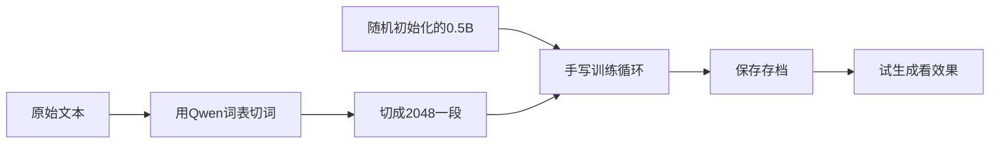

---

## 当前进度

截止 2026-09-19 晚上，我已经把第 0–7 步跑完。整条链路（数据 → 切词 → 打包 → 训练 → 存档 → 试生成）齐了。

我做过的：

- 项目目录在 `/root/autodl-tmp/llm-pretrain`
- 装 `tree` 之前踩过一个坑：直接 `apt install tree` 会报找不到包，要先 `apt update`
- 手敲并运行了 `scripts/check_gpu.py`：H800 可用，bf16 可用
- 手敲并运行了 `scripts/build_model.py`：只拉了词表和 `config.json`，随机初始化后参数量 **494.0M**
- 开第 3 步前复查了环境变量：`HF_HOME`、`HF_ENDPOINT` 已经指到数据盘和镜像
- 跑通了 `scripts/prepare_data.py`：wikitext-2 已打包。train 1203 段，valid 125 段，每段 2048 token
- 跑通了 `scripts/train.py`：100 步，loss 10.63 → 7.75，valid loss 7.83，存档 `checkpoints/latest.pt`
- 跑通了 `scripts/sample.py`：存档能加载，能出字（乱码），valid loss 仍是 7.8255 / ppl 2503.6
- 跑通了 `scripts/prepare_data_step7.py`：wikitext-103，约 1.22 亿 token，59442 段
- 跑通了 `scripts/train_step7.py`：16000 步，91.3 分钟，best valid **3.1991** / ppl **24.5**
- 跑通了 `scripts/sample_step7.py`：加载 `step7_best.pt`（step=14000），生成已经是英文句子，不再是虚词乱码；valid 仍是 3.1991 / ppl 24.5

下一阶段另开一篇，不写在这里。`step7_best.pt` 留着，不拿它当主力接着练。

下面每一步里，我把当时的命令、真实输出，以及我事后怎么理解，都记下来了。

---

## 开始之前我先记住 3 件事

1. **大文件只能放数据盘** `/root/autodl-tmp`。系统盘只有 30G，缓存默认会进 `/root/.cache`，一拉模型就把系统盘撑满，容器可能直接挂。
2. **国内机器拉 HuggingFace 要走镜像**。后面我每开一个新终端，都先设环境变量。
3. **先用很小的数据把流程跑通**。100 步能掉 loss、能存档、能生成乱码，就算成功。数据以后再加。

---

## 第 0 步：建目录，把缓存指到数据盘

我在终端里一条一条敲：

```bash
mkdir -p /root/autodl-tmp/llm-pretrain/{data/raw,data/packed,checkpoints,cache,scripts}
cd /root/autodl-tmp/llm-pretrain
```

建好后，这个项目长这样：

- `data/raw`：原始文章，人能看懂的文本
- `data/packed`：切好词、按固定长度切段后的训练数据
- `checkpoints`：训练中途保存的模型
- `cache`：下载词表、数据集的缓存，必须在这里，别进系统盘
- `scripts`：我手敲的 Python 脚本

每个新终端我都先执行下面这 4 行。不设的话，下载会写到系统盘，国内也很容易超时。

```bash
export HF_HOME=/root/autodl-tmp/llm-pretrain/cache
export HF_ENDPOINT=https://hf-mirror.com
export TOKENIZERS_PARALLELISM=false
cd /root/autodl-tmp/llm-pretrain
```

想省事，可以把这 4 行追加到 `~/.bashrc`。注意：只加这几行导出，别改别的 git / conda 配置。我这次没有写进 bashrc，所以换终端要重新 export。

我用 `df -h / /root/autodl-tmp` 看过一眼：系统盘大约 30G，数据盘大约 50G。后面如果系统盘涨得很快，多半是缓存路径没设对。

### 我当时怎么做的

目录已经建好，之后都在这里干活：

```text
~/autodl-tmp/llm-pretrain
```

想看目录树时，这台机器默认没有 `tree`。我当时敲了：

```bash
apt search tree
tree
apt install tree
```

结果：

```text
-bash: tree: command not found
E: Unable to locate package tree
```

原因不是源里没有这个包，而是**软件包列表还没更新**。源已经是华为云，`universe` 也开着。正确顺序：

```bash
apt update
apt install -y tree
tree /root/autodl-tmp/llm-pretrain
```

不想装的话，用 `find /root/autodl-tmp/llm-pretrain | sort` 也能看结构。

当时终端：

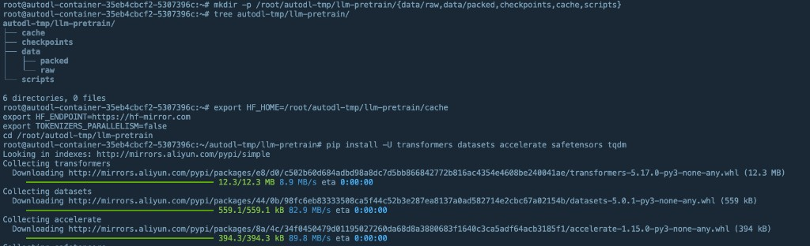

---

## 第 1 步：装库，确认这张卡能用

机器上已经有 Python 3.12 和 PyTorch 2.8（CUDA 12.8）。还缺训练大模型常用的几样：

```bash
pip install -U transformers datasets accelerate safetensors tqdm
```

我没装 TensorFlow，也没先配 `nvcc`。训练走 PyTorch 就行。`wandb` 先没装，loss 打到屏幕上就够。

当时终端：

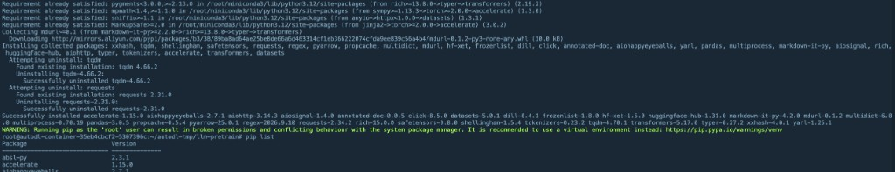

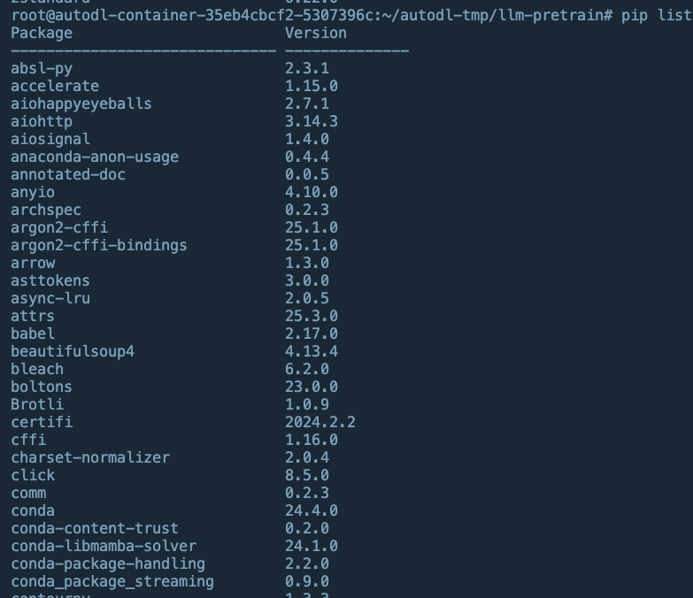

装完我新建了 `scripts/check_gpu.py`，敲进去：

```python
import torch

print("cuda:", torch.cuda.is_available())
print("gpu:", torch.cuda.get_device_name(0) if torch.cuda.is_available() else "none")
print("bf16:", torch.cuda.is_bf16_supported())
x = torch.randn(2, 4, device="cuda", dtype=torch.bfloat16)
print("tensor ok:", x.shape, x.dtype)
```

运行：

```bash
python scripts/check_gpu.py
```

正常应该看到：`cuda: True`，卡名带 `H800`，`bf16: True`。任何一项不对，我先停下来查，别急着训。

### 我当时怎么做的

我用 vim 写了 `scripts/check_gpu.py`，内容和上面一致，然后运行：

```bash
python scripts/check_gpu.py
```

真实输出：

```text
cuda: True
gpu: NVIDIA H800 PCIe
bf16: True
tensor ok: torch.Size([2, 4]) torch.bfloat16
```

结论：卡能用，bfloat16 能用。这一步我过了。

---

## 第 2 步：只要词表和结构，不要官方大脑

这里最容易走错。`from_pretrained("Qwen/Qwen2.5-0.5B")` 会把官方训练好的权重也拉下来。我这次要的是**从头预训练**，所以：

- 要：它的词表（怎么把字变成数字）
- 要：它的结构（几层、多宽、多少头）
- 不要：它已经训好的权重

词表大约 15 万个 token。**我没有自己训分词器**。训词表是另一门课，第一次会把时间耗光。

我新建了 `scripts/build_model.py`，自己敲，核心就这几件事：

1. 从镜像下载 `Qwen/Qwen2.5-0.5B` 的 tokenizer 和 config（第一次会比较慢，之后走 `cache/`）
2. `tokenizer.pad_token = tokenizer.eos_token`。Qwen 默认不一定有独立 pad，训练组 batch 时要用
3. 用 `AutoConfig.from_pretrained(...)` 拿到结构
4. 用 `Qwen2ForCausalLM(config)` **直接按结构新建**，不要 `from_pretrained` 整模
5. `model = model.to(dtype=torch.bfloat16, device="cuda")`
6. 打印参数量，大约 4 亿到 5 亿都算对
7. 随手喂一句中文，跑一次 `model.generate`，这时候输出基本是乱码，**这是对的**，因为权重还是随机的

对应代码可以按这个骨架写：

```python
from transformers import AutoConfig, AutoTokenizer, Qwen2ForCausalLM
import torch

name = "Qwen/Qwen2.5-0.5B"
tokenizer = AutoTokenizer.from_pretrained(name, trust_remote_code=True)
if tokenizer.pad_token is None:
    tokenizer.pad_token = tokenizer.eos_token

config = AutoConfig.from_pretrained(name, trust_remote_code=True)
model = Qwen2ForCausalLM(config)  # 随机初始化，不是加载官方权重
model = model.to(dtype=torch.bfloat16, device="cuda")

n = sum(p.numel() for p in model.parameters())
print("params(M):", round(n / 1e6, 1))
```

我先单独跑通这个脚本。能打印参数量，就算模型这块齐了。官方完整权重我暂时没下，省好几 G。

第一次我没改层数、宽度。跑通整个流程后，再把层数砍半做 0.1B 对比，会更有感觉。

### 我当时怎么做的

我用 vim 写了 `scripts/build_model.py`，按上面的骨架随机初始化，没有 `from_pretrained` 整模。然后运行：

```bash
python scripts/build_model.py
```

真实输出（第一次会下载词表，之后走缓存）：

```text
config.json: 100%|████| 681/681
tokenizer_config.json: 100%|████| 7.23k/7.23k
vocab.json: 100%|████| 2.78M/2.78M
merges.txt: 100%|████| 1.67M/1.67M
tokenizer.json: 100%|████| 7.03M/7.03M
params(M): 494.0
```

怎么读这份结果：

- 只下了 `config.json` 和词表，**没有官方权重**。这正是要从零训。
- `params(M): 494.0` 就是 Qwen2.5-0.5B 这套结构，大约 0.5B，数字对。
- 这些文件已经在数据盘：`cache/hub/models--Qwen--Qwen2.5-0.5B/`

当时终端：

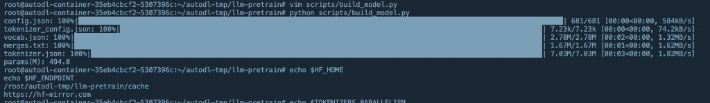

新开终端跑下一步之前，我先再执行第 0 步那 4 行 `export`，并用 `echo` 检查。不设的话，`datasets` 可能写到 `/root/.cache`，系统盘会涨。

这一步我过了。下面先做「第 3 步开始之前」的环境变量检查，再敲 `scripts/prepare_data.py`。

---

## 第 3 步开始之前：检查环境变量

`export` 只对**当前这个终端**有效。没写进 `~/.bashrc` 的话，关窗口、新开 SSH，变量就没了。第 3 步要下数据集，**我先检查，再写脚本**。

在准备跑数据脚本的那个终端里我执行：

```bash
echo $HF_HOME
echo $HF_ENDPOINT
echo $TOKENIZERS_PARALLELISM
```

要对上：

```text
/root/autodl-tmp/llm-pretrain/cache
https://hf-mirror.com
false
```

前两行不对，或者是空的，先补：

```bash
export HF_HOME=/root/autodl-tmp/llm-pretrain/cache
export HF_ENDPOINT=https://hf-mirror.com
export TOKENIZERS_PARALLELISM=false
cd /root/autodl-tmp/llm-pretrain
```

再 `echo` 一遍，对了再往下。

想让以后每个新终端都自动带上，可以把上面 3 行 `export` 追加到 `~/.bashrc`。只加这几行，别改别的。我这次没加。

### 我当时怎么做的

检查时发现：这 3 个变量**没有写进** `~/.bashrc` / `~/.profile`。我当时以为配过了，但新终端里其实是空的。上一回 `build_model.py` 能把词表写进数据盘，是因为那个终端里临时 `export` 过；换终端后就不算数了。

我在 `~/autodl-tmp/llm-pretrain` 里重新 export 之后检查：

```bash
echo $HF_HOME
echo $HF_ENDPOINT
```

真实输出：

```text
/root/autodl-tmp/llm-pretrain/cache
https://hf-mirror.com
```

结论：

- `HF_HOME` 指向数据盘缓存，下载不会进系统盘
- `HF_ENDPOINT` 走 HuggingFace 国内镜像
- 当前这个终端可以开始第 3 步

`TOKENIZERS_PARALLELISM` 当时没贴结果。没有的话我补一行 `export TOKENIZERS_PARALLELISM=false`，少一些警告，不挡下载。

---

## 第 3 步：先准备一份很小的文本

公共数据集盘 `/root/autodl-pub` 里没有适合语言模型预训练的网页语料，得自己准备。

**第一次我没下 FineWeb 全集。** 先做「冒烟数据」：人能看懂、体积很小、几分钟就能切完词。目标是几百万到一两千万 token，不是几十亿。

第一次我用英文小集 `Salesforce/wikitext` / `wikitext-2-raw-v1`。不要写成老名字 `wikitext`：我这台机器上的 `huggingface_hub` 较新，没有 `命名空间/名字` 会报 `HfUriError`。我没在浏览器下压缩包，脚本里 `load_dataset` 会走已经设好的 `HF_HOME` 和 `HF_ENDPOINT`。先没下 FineWeb 全集，也先没加中文，出错更好查。

脚本要做的事情：

1. 读 `text` 字段
2. 丢掉短于 50 个字符的行（wikitext 里空行很多）
3. 用 Qwen 词表切成 `input_ids`，篇尾加 `eos`
4. 所有文章首尾相接，按 2048 切开（packing），尾巴丢掉，不补 pad
5. 存到 `data/packed/train.pt` 和 `data/packed/valid.pt`

完整脚本我写在：[`/root/autodl-tmp/llm-pretrain/scripts/prepare_data.py`](/root/autodl-tmp/llm-pretrain/scripts/prepare_data.py)

```python
"""把一小份英文维基切成 2048 一段，存成训练/验证用的 packed 张量。"""

from pathlib import Path

import torch
from datasets import load_dataset
from transformers import AutoTokenizer

SEQ_LEN = 2048
MIN_CHARS = 50
MODEL_NAME = "Qwen/Qwen2.5-0.5B"
ROOT = Path("/root/autodl-tmp/llm-pretrain")
PACKED_DIR = ROOT / "data" / "packed"


def texts_to_ids(texts, tokenizer):
    """过滤短文，切词，每篇末尾加 eos，再拼成一条超长数字流。"""
    all_ids = []
    n_keep = 0
    for text in texts:
        if not text or len(text.strip()) < MIN_CHARS:
            continue
        ids = tokenizer(text, add_special_tokens=False)["input_ids"]
        if not ids:
            continue
        all_ids.extend(ids)
        all_ids.append(tokenizer.eos_token_id)
        n_keep += 1
    return all_ids, n_keep


def pack(all_ids, seq_len):
    """按 2048 切开。尾巴丢掉，不补 pad。"""
    n_seg = len(all_ids) // seq_len
    if n_seg == 0:
        raise SystemExit(f"token 太少（{len(all_ids)}），切不出一段 {seq_len}")
    used = n_seg * seq_len
    return torch.tensor(all_ids[:used], dtype=torch.long).view(n_seg, seq_len)


def dump_split(name, texts, tokenizer):
    all_ids, n_docs = texts_to_ids(texts, tokenizer)
    packed = pack(all_ids, SEQ_LEN)
    out = PACKED_DIR / f"{name}.pt"
    torch.save(packed, out)
    print(f"[{name}] 文章数: {n_docs}")
    print(f"[{name}] 总 token 数: {len(all_ids)}")
    print(f"[{name}] 切出来多少段: {packed.shape[0]}  形状: {tuple(packed.shape)}")
    print(f"[{name}] 已保存: {out}")
    return packed


def main():
    PACKED_DIR.mkdir(parents=True, exist_ok=True)

    tokenizer = AutoTokenizer.from_pretrained(MODEL_NAME, trust_remote_code=True)
    if tokenizer.pad_token is None:
        tokenizer.pad_token = tokenizer.eos_token

    # 老名字 wikitext 没有命名空间，新版 huggingface_hub 会报
    # Repository id must be 'namespace/name'。正式仓库是 Salesforce/wikitext。
    ds = load_dataset("Salesforce/wikitext", "wikitext-2-raw-v1")
    dump_split("train", ds["train"]["text"], tokenizer)
    dump_split("valid", ds["validation"]["text"], tokenizer)


if __name__ == "__main__":
    main()
```

我在已经设好环境变量的终端里跑：

```bash
cd /root/autodl-tmp/llm-pretrain
python scripts/prepare_data.py
```

第一次会下载 wikitext-2（很小），然后切词。跑完应打印 train / valid 各自的文章数、总 token 数、切出多少段。train 的总 token 一般会超过 10 万。

### 我当时怎么做的

第一次用老名字 `wikitext` 报错：`Repository id must be 'namespace/name'`。国内机器拉数据集前，我还跑过一次 `hf auth login`：

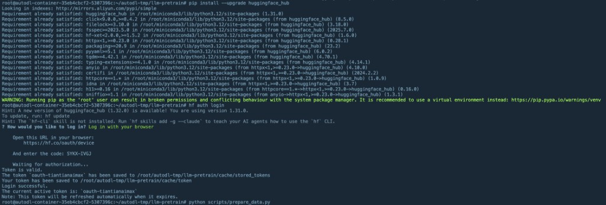

改成 `Salesforce/wikitext` 后我重新跑：

```bash
python scripts/prepare_data.py
```

下载了 README 和三个很小的 parquet（train 6.36MB，validation 657kB，test 733kB），然后切词打包。当时终端：

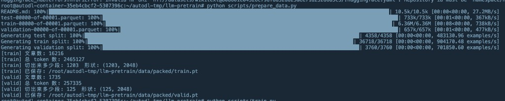

真实输出：

```text
[train] 文章数: 16216
[train] 总 token 数: 2465127
[train] 切出来多少段: 1203  形状: (1203, 2048)
[train] 已保存: /root/autodl-tmp/llm-pretrain/data/packed/train.pt
[valid] 文章数: 1735
[valid] 总 token 数: 257335
[valid] 切出来多少段: 125  形状: (125, 2048)
```

怎么读：

- 原始 train 有 36718 行，过滤掉空行和短行后剩 16216 篇，正常。wikitext 里标题、空行很多。
- 总 token 约 246 万，远超 10 万，100 步冒烟不会很快背完整个集。
- `1203 × 2048` 正好是满段；尾巴不满 2048 的被丢掉了，所以 2465127 不能被 2048 整除也没关系。
- valid 125 段，够算困惑度。
- 文件已经在数据盘 `data/packed/`。

这一步我过了。下一件是第 4 步：自己敲 `scripts/train.py`，先跑 100 步看 loss。

冒烟通过之后，再考虑加中文小集或 `fineweb-edu` 的一小片。整份数据我控制在 8–12G。

---

## 第 4 步：手写训练循环（这是这次的核心）

不要用 LLaMA-Factory，也不要一上来用 `Trainer`。我要自己看见这几行在干什么。

### 基于第 3 步，我先把这几处补清楚

数据已经在盘上，第 4 步不要再下载语料。直接读：

- `data/packed/train.pt`：形状 `(1203, 2048)`
- `data/packed/valid.pt`：形状 `(125, 2048)`

**100 步用不完一份数据。** batch=8 时，train 一轮大约 `1203 // 8 = 150` 个 batch（`drop_last=True` 丢掉余下的 3 段）。我只跑 100 步，还没走完一个 epoch，**不必**把 DataLoader 写成无限循环。以后加步数再循环。

**「步」怎么数，按骨架来：每送进模型一次 +1。** 所以 `max_steps = 100` 是 100 次前向，梯度累加 4 次才 `optimizer.step()` 一次，实际只更新 **25** 次参数。打印的 loss 用 `out.loss`（没除 4 的那个），那才是「预测下一个 token 有多差」。

**学习率也按这个 100 来。** warmup 取 `2%`，就是大约 2 步，冒烟时余弦几乎还没展开。别指望 100 步里看到完整的「先爬后降」曲线。函数可以写成：

```python
import math

def lr_at(step, max_steps, base_lr=3e-4, warmup_ratio=0.02):
    warmup = max(1, int(max_steps * warmup_ratio))
    if step < warmup:
        return base_lr * step / warmup
    progress = (step - warmup) / max(1, max_steps - warmup)
    return base_lr * 0.5 * (1.0 + math.cos(math.pi * progress))
```

改学习率：`for g in optimizer.param_groups: g["lr"] = lr_at(...)`。不要另装调度器。

**模型还是第 2 步那样搭：只要 config，随机初始化。** 不要 `from_pretrained` 整模。`train.py` 开头仍要能连上镜像读 `config.json`，所以跑之前环境变量还得在：

```bash
echo $HF_HOME
echo $HF_ENDPOINT
```

**DataLoader 可以很短。** `torch.load` 出来已经是 `[段数, 2048]` 的 LongTensor，可以直接喂：

```python
train = torch.load("data/packed/train.pt")  # [1203, 2048]
print("train:", tuple(train.shape), train[0, :20].tolist())  # 先看前 20 个数，别全是 0
loader = torch.utils.data.DataLoader(
    train, batch_size=8, shuffle=True, drop_last=True
)
```

每个 `batch` 形状是 `[8, 2048]`。`labels=batch` 即可，**不要自己再移位一次**，HuggingFace 的 CausalLM 内部会移。packing 切齐了，没有 pad，也不用 `ignore_index=-100`。

**valid 先别每步都算。** 125 段，batch=8，算一遍大约 16 个前向，H800 上很快，但 100 步冒烟够用「只存 latest，结束时再在 valid 上报一个平均 loss」。`best` 可以先不做，避免 100 步里写两个 6–8G 的档把盘占满。真要留 best，最多留 `latest.pt` + `best.pt` 两个。

**打印建议（每 10 步）：**

- `step`
- `loss`（`float(out.loss)`，不要用除过 `grad_accum` 的那个）
- `lr`
- `tokens/s`：`8 * 2048 / 这 10 步花的秒数`
- 显存：`torch.cuda.max_memory_allocated() / 1024**3`

**存档写到** `checkpoints/latest.pt`，里面至少有 `model`、`optimizer`、`step`、`loss`。加载时先按 config 新建空模型，再 `load_state_dict`。

**开头 loss 大概 10–12 才对**（随机权重 + 15 万词表）。如果一上来只有 2、3，多半误加载了官方权重。100 步里能掉一截（比如到 8、9）就算通。

我新建了 `scripts/train.py`。循环的人话版本是：

1. 读入 `train.pt`
2. 用 `DataLoader` 每次拿 8 段，也就是 batch size = 8
3. 每一段 2048 个数字送进模型
4. 模型要预测「下一个 token」。标签就是输入往左挪一格：`labels = input_ids`，HuggingFace 的 CausalLM 会在内部做移位。我只要把 `labels` 设成和 `input_ids` 一样
5. 算出交叉熵 loss，反向传播
6. 梯度累加 4 次再更新一次参数。这样等效大 batch，显存又不用爆
7. 更新前把梯度裁一下，最大范数 1.0，防止偶尔一个脏样本把模型打飞
8. 优化器用 `AdamW`，学习率 `3e-4`，前 2% 步数从 0 爬到峰值，后面按余弦降下去
9. 每步打印：第几步、loss、学习率、每秒多少 token、显存用了多少
10. 100 步结束时存一次 `checkpoints/latest.pt`。冒烟阶段先不留一串历史档；`best` 可先不做

第一次跑的超参，我直接按这个用，先没调：

- 精度：bfloat16
- 每段长度：2048
- 每次送进模型：8 段
- 梯度累加：4 次，等于一次更新看 32 段
- 学习率：`3e-4`
- 权重衰减：`0.1`
- 先只跑：`max_steps = 100`

训练循环骨架（按这个顺序敲，边敲边理解）：

```python
model.train()
optimizer = torch.optim.AdamW(model.parameters(), lr=3e-4, weight_decay=0.1)
optimizer.zero_grad(set_to_none=True)

for step, batch in enumerate(loader, start=1):
    batch = batch.to("cuda")
    out = model(input_ids=batch, labels=batch)
    loss = out.loss / grad_accum
    loss.backward()

    if step % grad_accum == 0:
        torch.nn.utils.clip_grad_norm_(model.parameters(), 1.0)
        optimizer.step()
        # 这里改学习率（warmup + cosine）
        optimizer.zero_grad(set_to_none=True)

    if step % 10 == 0:
        print(step, float(out.loss), lr)

    if step >= max_steps:
        break
```

存档时至少保存这些，后面才能续训：

- `model.state_dict()`
- `optimizer.state_dict()`
- 当前 `step`
- 当时的 `loss`

保存用 `torch.save` 即可。加载时先按第 2 步那样新建空模型，再 `load_state_dict`。

学习率怎么变，自己写个函数就行，不必上复杂调度器：

- 步数不到 warmup：`lr = 3e-4 * step / warmup_steps`
- 之后：从峰值按余弦降到接近 0

完整脚本我写在：[`/root/autodl-tmp/llm-pretrain/scripts/train.py`](/root/autodl-tmp/llm-pretrain/scripts/train.py)

第四步我执行的就是这个文件，不是 `prepare_data.py`，也不是 `build_model.py`。

```python
"""随机初始化 Qwen2.5-0.5B 结构，用 packed train.pt 手写循环跑 100 步。"""

import math
import time
from pathlib import Path

import torch
from torch.utils.data import DataLoader
from transformers import AutoConfig, Qwen2ForCausalLM

ROOT = Path("/root/autodl-tmp/llm-pretrain")
TRAIN_PT = ROOT / "data" / "packed" / "train.pt"
VALID_PT = ROOT / "data" / "packed" / "valid.pt"
CKPT_DIR = ROOT / "checkpoints"
MODEL_NAME = "Qwen/Qwen2.5-0.5B"

SEQ_LEN = 2048
BATCH_SIZE = 8
GRAD_ACCUM = 4
MAX_STEPS = 100
BASE_LR = 3e-4
WEIGHT_DECAY = 0.1
CLIP = 1.0
LOG_EVERY = 10


def lr_at(step, max_steps, base_lr=BASE_LR, warmup_ratio=0.02):
    warmup = max(1, int(max_steps * warmup_ratio))
    if step < warmup:
        return base_lr * step / warmup
    progress = (step - warmup) / max(1, max_steps - warmup)
    return base_lr * 0.5 * (1.0 + math.cos(math.pi * progress))


def set_lr(optimizer, lr):
    for group in optimizer.param_groups:
        group["lr"] = lr


def build_model():
    # 只要图纸，不要官方权重
    config = AutoConfig.from_pretrained(MODEL_NAME, trust_remote_code=True)
    model = Qwen2ForCausalLM(config)
    return model.to(dtype=torch.bfloat16, device="cuda")


@torch.no_grad()
def valid_loss(model, batch_size):
    data = torch.load(VALID_PT, map_location="cpu")
    loader = DataLoader(data, batch_size=batch_size, shuffle=False, drop_last=True)
    model.eval()
    total, n = 0.0, 0
    for batch in loader:
        batch = batch.to("cuda")
        out = model(input_ids=batch, labels=batch)
        total += float(out.loss)
        n += 1
    model.train()
    return total / max(1, n)


def main():
    CKPT_DIR.mkdir(parents=True, exist_ok=True)

    train = torch.load(TRAIN_PT, map_location="cpu")
    print("train:", tuple(train.shape), train.dtype)
    print("train[0, :20]:", train[0, :20].tolist())

    loader = DataLoader(train, batch_size=BATCH_SIZE, shuffle=True, drop_last=True)
    model = build_model()
    n = sum(p.numel() for p in model.parameters())
    print("params(M):", round(n / 1e6, 1))

    optimizer = torch.optim.AdamW(model.parameters(), lr=BASE_LR, weight_decay=WEIGHT_DECAY)
    optimizer.zero_grad(set_to_none=True)
    model.train()

    last_raw_loss = None
    t0 = time.time()
    tokens_window = 0

    for step, batch in enumerate(loader, start=1):
        batch = batch.to("cuda")
        # labels 和 input 一样，模型内部会右移；不要自己再移一次
        out = model(input_ids=batch, labels=batch)
        last_raw_loss = out.loss.detach().item()
        (out.loss / GRAD_ACCUM).backward()
        tokens_window += BATCH_SIZE * SEQ_LEN

        if step % GRAD_ACCUM == 0:
            torch.nn.utils.clip_grad_norm_(model.parameters(), CLIP)
            optimizer.step()
            optimizer.zero_grad(set_to_none=True)

        lr = lr_at(step, MAX_STEPS)
        set_lr(optimizer, lr)

        if step % LOG_EVERY == 0:
            dt = max(time.time() - t0, 1e-6)
            mem = torch.cuda.max_memory_allocated() / 1024**3
            print(
                f"step {step:4d}  loss {last_raw_loss:.4f}  lr {lr:.2e}  "
                f"tokens/s {tokens_window / dt:.0f}  mem {mem:.2f}G"
            )
            t0 = time.time()
            tokens_window = 0

        if step >= MAX_STEPS:
            break

    ckpt = CKPT_DIR / "latest.pt"
    torch.save(
        {
            "model": model.state_dict(),
            "optimizer": optimizer.state_dict(),
            "step": MAX_STEPS,
            "loss": last_raw_loss,
        },
        ckpt,
    )
    print("saved:", ckpt)

    vloss = valid_loss(model, BATCH_SIZE)
    print(f"valid loss: {vloss:.4f}  ppl: {math.exp(min(vloss, 20)):.1f}")


if __name__ == "__main__":
    main()
```

跑之前我先确认环境变量还在，然后：

```bash
cd /root/autodl-tmp/llm-pretrain
echo $HF_HOME
echo $HF_ENDPOINT
python scripts/train.py
```

**我先看 100 步。** 随机初始化、15 万词表，开头的 loss 常常在 10 到 12。如果 100 步里能明显往下走，比如掉到 8 或 9，就说明数据和循环是通的。掉到多少不重要，方向对就行。

### 我当时怎么做的

```bash
python scripts/train.py
```

真实输出（完整）：

```text
root@autodl-container-35eb4cbcf2-5307396c:~/autodl-tmp/llm-pretrain# python scripts/train.py
train: (1203, 2048) torch.int64
train[0, :20]: [5363, 73, 55661, 902, 85162, 88, 4204, 220, 18, 549, 1230, 8548, 291, 65316, 320, 10769, 549, 49434, 99, 74167]

params(M): 494.0
/root/autodl-tmp/llm-pretrain/scripts/train.py:86: UserWarning: Converting a tensor with requires_grad=True to a scalar may lead to unexpected behavior.
Consider using tensor.detach() first. (Triggered internally at /pytorch/torch/csrc/autograd/generated/python_variable_methods.cpp:835.)
  last_raw_loss = float(out.loss)
step   10  loss 10.6297  lr 2.95e-04  tokens/s 45776  mem 57.35G
step   20  loss 9.9442  lr 2.76e-04  tokens/s 48723  mem 57.35G
step   30  loss 9.1361  lr 2.44e-04  tokens/s 48870  mem 57.35G
step   40  loss 8.7023  lr 2.02e-04  tokens/s 48511  mem 57.35G
step   50  loss 8.3015  lr 1.55e-04  tokens/s 48806  mem 57.35G
step   60  loss 8.1429  lr 1.07e-04  tokens/s 48514  mem 57.35G
step   70  loss 8.0632  lr 6.42e-05  tokens/s 48808  mem 57.35G
step   80  loss 7.8647  lr 2.98e-05  tokens/s 48368  mem 57.35G
step   90  loss 7.9153  lr 7.64e-06  tokens/s 48785  mem 57.35G
step  100  loss 7.7540  lr 0.00e+00  tokens/s 48331  mem 57.35G
saved: /root/autodl-tmp/llm-pretrain/checkpoints/latest.pt
valid loss: 7.8255  ppl: 2503.6
```

当时终端：

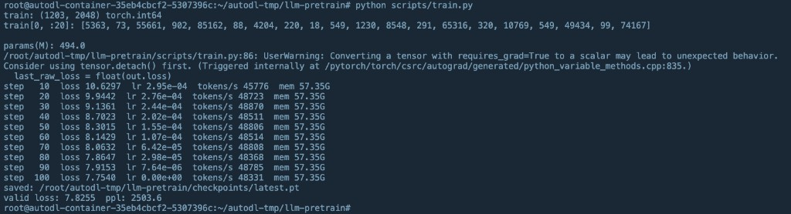

怎么读：

- 前 20 个数字不是全 0，数据读对了。
- 494.0M、开头 loss 10.6：确认是随机初始化，没有误加载官方权重。
- 100 步里 10.63 → 7.75：训练循环通了。valid 7.83 和 train 接近，没有明显只背训练集。
- ppl 2503 仍然很大，正常。100 步、25 次参数更新，模型还不会说人话。
- 第 100 步 lr 变成 0：余弦调度在最后一步降到 0，公式如此，不是坏了。
- 显存 57G：0.5B + 序列 2048 + batch 8，激活很大。H800 80G 还装得下。
- 中间有一条 `float(out.loss)` 的警告，已经改成 `out.loss.detach().item()`。下次再跑不会再刷这句。

存档在 `checkpoints/latest.pt`。这一步我过了。下一件是第 5 步：写 `scripts/sample.py`，加载这个档试着生成。

---

## 第 5 步：加载存档，试着说话

第五步我执行的是 **`scripts/sample.py`**，不是再跑一遍 `train.py`。

做两件事：

1. **生成**：加载 `checkpoints/latest.pt`。先按 `config.json` 搭空网络，再 `load_state_dict` 灌进我自己训的权重。用「北京是」和 `The meaning of life is` 做开头，`temperature=0.8`，最多续 80 个 token。
2. **算困惑度**：在 `valid.pt` 上算平均 loss，再 `exp(loss)`。训练结束时已经报过 7.83 / 2503，这里应接近这个数。

加载方式必须和训练一致：只要图纸 + 我的档，**不要** `from_pretrained` 整模，否则又变成官方大脑，生成会突然很像人话，那是在作弊。

生成早期几乎一定是乱码、复读、中英夹杂。这不代表失败。失败是：脚本报错、存档加载不上。

完整脚本我写在：[`/root/autodl-tmp/llm-pretrain/scripts/sample.py`](/root/autodl-tmp/llm-pretrain/scripts/sample.py)

```python
"""加载第 4 步的存档，试着续写，并在 valid.pt 上算困惑度。"""

import math
from pathlib import Path

import torch
from torch.utils.data import DataLoader
from transformers import AutoConfig, AutoTokenizer, Qwen2ForCausalLM

ROOT = Path("/root/autodl-tmp/llm-pretrain")
CKPT = ROOT / "checkpoints" / "latest.pt"
VALID_PT = ROOT / "data" / "packed" / "valid.pt"
MODEL_NAME = "Qwen/Qwen2.5-0.5B"
BATCH_SIZE = 8
MAX_NEW_TOKENS = 80
TEMPERATURE = 0.8

PROMPTS = [
    "北京是",
    "The meaning of life is",
]


def load_model_and_tokenizer():
    tokenizer = AutoTokenizer.from_pretrained(MODEL_NAME, trust_remote_code=True)
    if tokenizer.pad_token is None:
        tokenizer.pad_token = tokenizer.eos_token

    # 先按图纸搭空网络，再灌进我自己训的权重，不要 from_pretrained 整模
    config = AutoConfig.from_pretrained(MODEL_NAME, trust_remote_code=True)
    model = Qwen2ForCausalLM(config)
    ckpt = torch.load(CKPT, map_location="cpu")
    model.load_state_dict(ckpt["model"])
    model = model.to(dtype=torch.bfloat16, device="cuda")
    model.eval()
    print(f"loaded {CKPT}  step={ckpt.get('step')}  train_loss={ckpt.get('loss')}")
    return model, tokenizer


@torch.no_grad()
def generate(model, tokenizer, prompt):
    inputs = tokenizer(prompt, return_tensors="pt").to("cuda")
    out = model.generate(
        **inputs,
        max_new_tokens=MAX_NEW_TOKENS,
        do_sample=True,
        temperature=TEMPERATURE,
        pad_token_id=tokenizer.eos_token_id,
    )
    return tokenizer.decode(out[0], skip_special_tokens=False)


@torch.no_grad()
def valid_ppl(model):
    data = torch.load(VALID_PT, map_location="cpu")
    loader = DataLoader(data, batch_size=BATCH_SIZE, shuffle=False, drop_last=True)
    total, n = 0.0, 0
    for batch in loader:
        batch = batch.to("cuda")
        out = model(input_ids=batch, labels=batch)
        total += out.loss.detach().item()
        n += 1
    loss = total / max(1, n)
    return loss, math.exp(min(loss, 20))


def main():
    model, tokenizer = load_model_and_tokenizer()

    for prompt in PROMPTS:
        text = generate(model, tokenizer, prompt)
        print("=" * 60)
        print("prompt:", prompt)
        print("output:", text)

    loss, ppl = valid_ppl(model)
    print("=" * 60)
    print(f"valid loss: {loss:.4f}  ppl: {ppl:.1f}")
    print("100 步后生成几乎一定是乱码，能出字、能加载存档就算成功。")


if __name__ == "__main__":
    main()
```

跑之前环境变量还得在：

```bash
cd /root/autodl-tmp/llm-pretrain
echo $HF_HOME
echo $HF_ENDPOINT
python scripts/sample.py
```

### 我当时怎么做的

```bash
python scripts/sample.py
```

真实输出：

```text
loaded /root/autodl-tmp/llm-pretrain/checkpoints/latest.pt  step=100  train_loss=7.753992080688477
============================================================
prompt: 北京是
output: 北京是  the0 the  for , and . , , , of , of the in . the . part the in , the the the the to of of . in and and . . to@ of0 before , the the , . , , and and , the the . ,  the . , ,  the  of , the , the  , in the , " ,  of the the
============================================================
prompt: The meaning of life is
output: The meaning of life is the8 , and and . , the a the , the was .@ of the the  The the "  and . the . 
 . the the the , the . " the and in . ,1 .  . before the , them , the in of the the of of0 " ,  1 , , , ,0 the  The of in  . in , to @ the
============================================================
valid loss: 7.8255  ppl: 2503.6
100 步后生成几乎一定是乱码，能出字、能加载存档就算成功。
```

怎么读：

- `loaded ... step=100 train_loss=7.75`：存档读对了，灌进去的是我自己训的权重。
- valid loss 7.8255、ppl 2503.6：和训练结束时完全一致，说明 `sample.py` 加载的就是那份档，不是官方模型。
- 生成是乱码，但已经是英文里最常见的虚词（`the` / `of` / `and`）。训练数据是英文维基，100 步只够摸到高频词，还不会组句。
- 「北京是」后面也切到英文垃圾，正常：这份数据几乎没有中文。

这一步我过了。整条冒烟链路（数据 → 训练 → 存档 → 生成）已经跑通。

---

## 第 6 步：怎么判断我没写错

第 6 步**没有新脚本，也不用再跑命令。**  
它就是一张验收清单：拿第 3、4、5 步已经打出来的结果，对一下「链路通没通」。通了就结束；不通才去看下面的排查。

前面四条我都已经对上了，第 6 步对我来说是**已经做完的**。

### 清单（通用）

- 100 步内 loss 明显下降
- `checkpoints/` 里能看到文件，而且可以再加载
- `sample.py` 能打出字（哪怕是垃圾字）
- 训练时 GPU 显存不是 0

### 我的实际对照

| 清单要看什么 | 我已经有的结果 | 过没过 |
|---|---|---|
| loss 下降 | 第 10 步 10.63 → 第 100 步 7.75 | 过 |
| 存档能加载 | `sample.py` 打出 `loaded ... step=100 train_loss=7.75` | 过 |
| 能出字 | 「北京是」「The meaning of life is」后面都续出了一串 token | 过 |
| GPU 在干活 | 训练时 mem 57.35G | 过 |
| 不是官方权重 | 开头 loss 10.6，生成是乱码，valid 7.8255 和训练结束一致 | 过 |

下面那几条排查（数据全 0、学习率一直 0、label 移错位、误加载官方权重）是 **loss 不降时才看的**。我的 loss 在降，不用走排查。

系统盘突然涨：`du -sh /root/.cache /root/autodl-tmp/llm-pretrain/cache`，多半是忘了 `export HF_HOME`。我训练和采样都走了数据盘缓存，这条也没踩。

**结论：第 6 步没有要补的操作。** 我只是用自己的数字把清单勾上。勾上了。想继续练，才是第 7 步（加数据、加时长）。

---

## 第 7 步：冒烟过了再加时长

第 7 步**不改**第 3–5 步的脚本，我另开三个新文件，数据和存档也分开，免得把冒烟结果盖掉。

留下不动的：

- `scripts/prepare_data.py`、`scripts/train.py`、`scripts/sample.py`
- `data/packed/train.pt`、`data/packed/valid.pt`（wikitext-2，1203 / 125 段）
- `checkpoints/latest.pt`、`checkpoints/smoke100.pt`（100 步冒烟档）

第 7 步新脚本：

- [`scripts/prepare_data_step7.py`](/root/autodl-tmp/llm-pretrain/scripts/prepare_data_step7.py)：下 `wikitext-103-raw-v1`，写到 `data/packed_step7/`
- [`scripts/train_step7.py`](/root/autodl-tmp/llm-pretrain/scripts/train_step7.py)：从 `smoke100.pt` 接着训 16000 步（大约 1.5 小时），存 `checkpoints/step7_latest.pt` 和 `step7_best.pt`
- [`scripts/sample_step7.py`](/root/autodl-tmp/llm-pretrain/scripts/sample_step7.py)：加载第 7 步存档，用 `packed_step7/valid.pt` 算困惑度

为什么要换大集：wikitext-2 只有约 250 万 token，跑 1 小时会把同一份数据翻几十遍，loss 会假摔。wikitext-103 大约 1 亿 token，打包后大约 1G。

跑法（环境变量还得在）：

```bash
export HF_HOME=/root/autodl-tmp/llm-pretrain/cache
export HF_ENDPOINT=https://hf-mirror.com
export TOKENIZERS_PARALLELISM=false
cd /root/autodl-tmp/llm-pretrain

python scripts/prepare_data_step7.py
python scripts/train_step7.py
python scripts/sample_step7.py
```

`train_step7.py` 要跑大约 1.5 小时，终端别关。想更稳可以用 `tmux` 或 `screen`，也可以把输出重定向到日志：

```bash
python scripts/train_step7.py 2>&1 | tee /root/autodl-tmp/llm-pretrain/train_step7.log
```

跑久一点之后，生成里开始出现像词的片段，valid 的困惑度会往下走。

### 我当时怎么做的（准备数据）

环境变量设好后我跑了：

```bash
python scripts/prepare_data_step7.py
```

下载了 wikitext-103 的两个 train parquet（各 157MB），然后切词。当时终端：

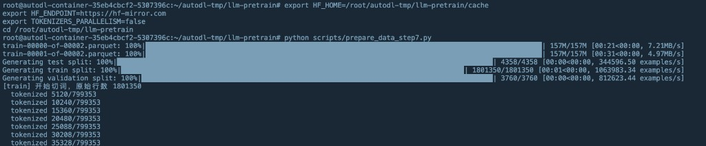

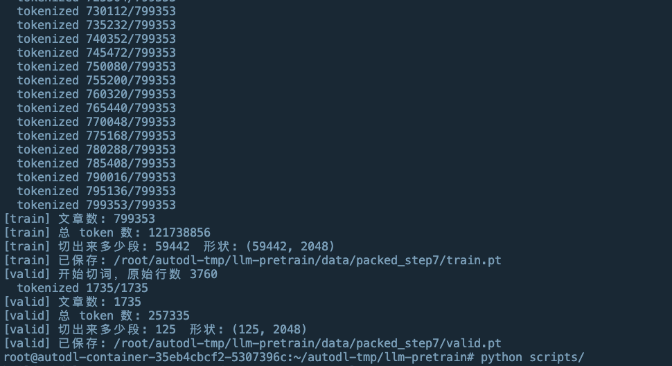

真实输出（节选统计）：

```text
[train] 开始切词，原始行数 1801350
  tokenized 799353/799353
[train] 文章数: 799353
[train] 总 token 数: 121738856
[train] 切出来多少段: 59442  形状: (59442, 2048)
[train] 已保存: /root/autodl-tmp/llm-pretrain/data/packed_step7/train.pt
[valid] 文章数: 1735
[valid] 总 token 数: 257335
[valid] 切出来多少段: 125  形状: (125, 2048)
[valid] 已保存: /root/autodl-tmp/llm-pretrain/data/packed_step7/valid.pt
```

怎么读：

- 原始 train 180 万行，过滤空行/短行后剩约 80 万篇，正常。
- 总 token 约 **1.22 亿**，大约是冒烟那份 246 万的 50 倍。16000 步大约吃 1.5 亿 token，只会把这份数据过一轮出头，不会假摔。
- `59442 × 2048` 满段；valid 仍是 125 段（wikitext-103 和 wikitext-2 共用同一份验证集）。
- 文件在 `data/packed_step7/`，没有覆盖冒烟的 `data/packed/`。

下一步我跑了 `python scripts/train_step7.py`，大约 1.5 小时。

### 我当时怎么做的（训练，从第 2000 步记到结束）

```bash
python scripts/train_step7.py 2>&1 | tee /root/autodl-tmp/llm-pretrain/train_step7.log
```

开头确认接着冒烟档：`resume ... smoke100.pt  old_step=100  old_loss=7.75`。

第 2000 步第一次算验证集并存档：

```text
step   2000  loss 4.4198  lr 2.92e-04  tokens/s 48618  mem 57.35G  elapsed 11.2min
valid loss: 4.4000  ppl: 81.5
saved: /root/autodl-tmp/llm-pretrain/checkpoints/step7_latest.pt
saved: /root/autodl-tmp/llm-pretrain/checkpoints/step7_best.pt
```

怎么读：

- train loss 从 7.70 降到约 4.42，valid 4.40，两者几乎一样，不是只背训练集。
- ppl 从冒烟时的 **2503 降到 81.5**：平均犹豫的词从「好几千个」变成「大约八十个」，这是第 7 步当时最明显的进步。
- 第 2050 步 `tokens/s` 掉到 33918，是因为刚做完 valid + 写了两个 2.8G 的档，不是卡坏了，后面又回到约 48600。
- 目标还是 16000 步。当时大约还要 1 小时，终端不能关。

第 4000 步第二次验收：

```text
step   4000  loss 3.8006  lr 2.61e-04  elapsed 22.6min
valid loss: 3.7480  ppl: 42.4
saved: .../step7_latest.pt
saved: .../step7_best.pt
```

ppl 从 2000 步的 81.5 再降到 **42.4**，valid 和 train 仍然贴在一起。第 4050 步 tokens/s 再次变慢，还是存档导致的。我继续跑到 16000。

第 6000 步：valid **3.46**，ppl **31.7**（34.1 分钟）。  
第 8000 步：valid **3.32**，ppl **27.5**（45.5 分钟）。已经过半，下降变慢是正常的（越好越难再降）。`step7_best.pt` 每次都在更新，说明验证集还在变好。当时大约还要 45 分钟。

第 10000 步：valid **3.24**，ppl **25.5**（56.9 分钟）。  
第 12000 步：valid **3.21**，ppl **24.7**（68.3 分钟）。  
第 14000 步：valid **3.20**，ppl **24.5**（79.8 分钟）。后面几乎走平。

### 训练结束

```text
step  16000  loss 3.2374  lr 0.00e+00  tokens/s 48617  mem 57.35G  elapsed 91.2min
valid loss: 3.1991  ppl: 24.5
saved: /root/autodl-tmp/llm-pretrain/checkpoints/step7_latest.pt
done. steps=16000  elapsed=91.3min  best_valid=3.1991
```

16000 步、91.3 分钟我跑完了。最终 valid 和 14000 步一样（3.1991 / 24.5），最后两千步没有再涨也没有再降，学习率收到 0。`step7_best.pt` 就是这份最好成绩。

冒烟对比：ppl 2503 → 24.5。

### 试生成（`sample_step7.py`）

```text
python scripts/sample_step7.py
loaded .../step7_best.pt  step=14000  train_loss=3.504...  valid_loss=3.199096441268921
============================================================
prompt: 北京是
output: 北京是 was used to represent the " C " of " F " as the result for " 99 % " of the album 's title track on the album . These songs were later added to the album 's liner notes , " P @-@ G " ( " 2006 @-@ 2009 " ) and " I Want You " ( " 2
============================================================
prompt: The meaning of life is
output: The meaning of life is a natural resource of their environment . " The word is derived from the Greek vassic ( " and for " in the present " ) , meaning " to be in the centre of the sky " . The word may also have been used as a term for the word " to have " , but it may be as similar to the word simply refers to an individual who is in the same family .
============================================================
valid loss: 3.1991  ppl: 24.5
```

当时终端（训练收尾和这次生成在同一屏）：

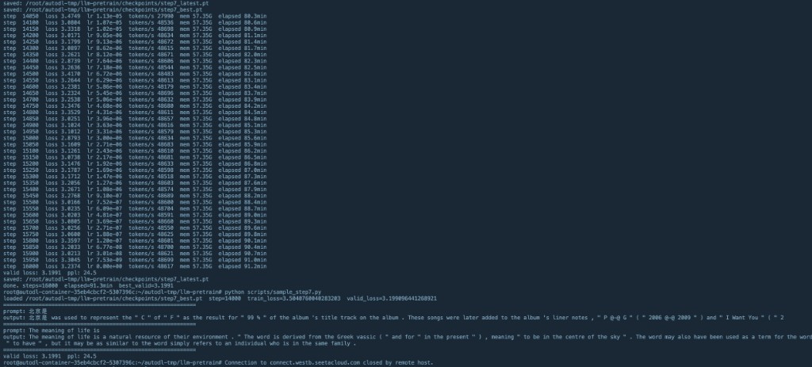

怎么读这段输出：

- **加载的是 14000 步的 best，不是 16000 步的 latest。** 后 2000 步 valid 没有更好，所以 best 停在 14000。这是对的。
- **valid / ppl 和训练结束完全一样**（3.1991 / 24.5），说明加载的就是刚训完的档，不是官方权重。
- **比冒烟进步很大。** 当时只会蹦 `the` / `of` / `and`；现在能写出带引号、括号、维基风格从句的英文句子。
- **内容仍然是胡编。** “生命的意义是一种自然资源”“希腊词 vassic”都是假的。它学会了**英文维基的腔调**，没有学会事实。
- **中文 prompt 后面接英文。** 训练集是 wikitext-103（英文维基），几乎没中文。词表认识「北京是」，模型却只会用英文往下写。`@-@` 是 wikitext 里连字符的写法，说明它连语料格式都学进去了。

这一步我过了。流程通了，loss 也降了，生成从乱码变成英文句子。它还不会聊天，中文一开口就接英文，内容也是编的。

这篇写到第 7 步为止。后面怎么把它训成能问答，另开一篇。

---

## 磁盘我心里要有数（第 0–7 步当时）

第 0–7 步是在 50G 数据盘上跑的，当时大概是这样：

- 词表 + 配置 + 缓存：大约 2–3G
- 练习数据和 packed 文件：控制在 8–12G
- 每个训练存档大约 2.8G，当时留了 4 个，大约 11G
- 整个项目大约 13G，数据盘还剩大约 38G

我没往 `/root/.cache` 写，也没挂 `/root/autodl-nas`。

后面还要下更大的数据，这 50G 不够，得扩盘。需要多大写在下一篇。

---

## 第 0–7 步我先没做的

- 没从零训 7B / 14B
- 没上 Megatron、DeepSpeed ZeRO-3。0.5B 单卡用不上
- 没自己训 tokenizer
- 没下 FineWeb

当时就是先把小流程跑通。后面要下更大的数据，盘另算，写在下一篇。

---

## 今天做完的顺序

1. ~~建目录，export 四个环境变量~~ 已做
2. ~~`pip install`，敲并运行 `check_gpu.py`~~ 已做，H800 + bf16 通过
3. ~~敲并运行 `build_model.py`~~ 已做，参数量 494.0M，只拉了词表
4. ~~第 3 步开始前复查环境变量~~ 已做，`HF_HOME` / `HF_ENDPOINT` 正确
5. ~~敲并运行 `prepare_data.py`~~ 已做，train 1203 段、valid 125 段，每段 2048
6. ~~敲并运行 `train.py`~~ 已做，loss 10.63 → 7.75，已存 `checkpoints/latest.pt`
7. ~~敲并运行 `sample.py`~~ 已做，存档能加载，生成是乱码，valid 7.8255 / ppl 2503.6
8. ~~第 7 步加数据、加时长~~ 训练已完成：16000 步、91.3 分钟，best valid 3.20 / ppl 24.5
9. ~~跑 `sample_step7.py` 看生成~~ 已做：英文句子、内容胡编、中文 prompt 接英文；valid 3.20 / ppl 24.5

每一步我只做一件事。上一步没跑通，不要开始下一步。

这篇到第 7 步结束。下一阶段另开一篇。

---

## 附录：我下载的这几个文件分别是什么

跑 `build_model.py` 时，机器没有把 Qwen 的「大脑」拉下来，只拉了 5 个小文件。它们都在数据盘：

`/root/autodl-tmp/llm-pretrain/cache/hub/models--Qwen--Qwen2.5-0.5B/`

先记一句总原则：

- **这 5 个文件 = 图纸 + 词典**。告诉程序模型长什么样、字怎么变成数字。
- **官方权重（没下）= 已经训好的脑子**。那种文件通常叫 `model.safetensors` 或 `pytorch_model.bin`，会大很多。我这次故意没下。

人写字，模型只认整数。词表负责「北京是」→ `[一串数字]`；`config.json` 负责「用多少层、多宽的网络去消化这些数字」。

### 1. `config.json`（681 字节）— 模型的图纸

里面是一段很小的 JSON，我这份真实内容大致是：

- `model_type: qwen2`，`architectures: Qwen2ForCausalLM`：按 Qwen2 的因果语言模型来建
- `hidden_size: 896`：每一层向量有多宽
- `num_hidden_layers: 24`：堆 24 层
- `num_attention_heads: 14`：注意力有 14 个头
- `num_key_value_heads: 2`：KV 头更少，省显存（GQA）
- `intermediate_size: 4864`：MLP 中间层有多宽
- `vocab_size: 151936`：词表按 15 万出头的格子来建（含预留位）
- `bos_token_id` / `eos_token_id`：开头、结束用哪个数字，我这份里都是 `151643`
- `torch_dtype: bfloat16`：官方建议用 bf16 存

`Qwen2ForCausalLM(config)` 就是读这张图纸，按尺寸把网络搭起来，权重用随机数填。所以我打印出 `params(M): 494.0`。改这里的层数、宽度，模型大小会变；第一次别改。

它**不是**训练好的知识。里面没有任何「北京是中国的首都」这种内容。

### 2. `tokenizer_config.json`（7.23KB）— 分词器的使用说明

告诉 HuggingFace：**怎么用** 这个词表，本身几乎不含词条。

我这份里比较重要的：

- `tokenizer_class: Qwen2Tokenizer`：用哪一种分词程序
- `eos_token` / `pad_token`: `<|endoftext|>`。结束、补齐用同一个特殊符号。所以文档里写 `pad_token = eos_token`
- `bos_token: null`：Qwen 默认不加开头符
- `model_max_length: 131072`：分词器声称能扛的最长上下文（我训练仍用 2048）
- `added_tokens_decoder`：特殊符号和数字的对照。例如 `151643 = <|endoftext|>`，还有 `<|im_start|>`、`<|im_end|>`（对话起止），以及视觉、工具调用等占位符
- `chat_template`：一段模板，规定对话要包成「`<|im_start|>user ... <|im_end|>`」这种格式。预训练先不用管；以后做指令微调才会用到

作用：程序才知道结束符是谁、对话怎么拼、哪些 token 是特殊符号不能拆开。

### 3. `vocab.json`（2.78MB）— 词到数字的对照表

一个超大字典：`{"!": 0, "\"": 1, ... "hello": 14990, "Ġthe": 279, ...}`。

我这份大约 **151643** 条。`Ġ` 表示前面有空格，这是 GPT-2 / Qwen 这类 BPE 的习惯写法。

作用：把切出来的小片段映射成整数。模型最后一层也按「有多少个词」来预测下一个数字。没有这份表，文本和整数对不上。

它通常**不含** `<|endoftext|>` 这种后加的特殊符号，那些写在 `tokenizer_config.json` 和 `tokenizer.json` 的 `added_tokens` 里。

中文往往不会整词出现在表里。像「北京」可能被切成更小的字或字块，再各自变成数字。这是 BPE 的正常现象，不是词表坏了。

### 4. `merges.txt`（1.67MB）— 怎么把字节拼成词

BPE 的合并规则，一行一条，我这份大约 **15 万行**。开头几行长这样：

```text
Ġ Ġ
i n
Ġ t
e r
Ġt h
```

人话：先把字拆成很小的块（甚至字节），再按这份清单，高频的两块合成一块。`i` + `n` → `in`，`Ġt` + `h` → `Ġth`，反复合并，直到不能合或合完。

作用：决定「international」是整段一个 token，还是拆成 `inter` + `national`。和 `vocab.json` 配套，才是完整的 BPE 词表。

### 5. `tokenizer.json`（7.03MB）— 分词器的一体打包

HuggingFace `tokenizers` 库的完整存档，几乎把上面几样揉在一个文件里：

- `model.type: BPE`，以及一份 `vocab` + `merges`（和那两个单独文件是同一套规则）
- `added_tokens`：22 个特殊符号，从 `151643` 的 `<|endoftext|>` 往后排
- `normalizer` / `pre_tokenizer` / `decoder`：切之前怎么规范化、按字节切、切完怎么变回字

作用：新代码优先读这一个文件就能还原整套分词。`vocab.json` + `merges.txt` 是老式 GPT-2 布局，留给兼容用。我调用 `AutoTokenizer.from_pretrained` 时，库会自己挑，不必手读。

### 这 5 个文件怎么配合

```text
一篇中文/英文
    → tokenizer.json（或 vocab.json + merges.txt）切成小块
    → 每个小块变成整数 input_ids
    → 按 config.json 搭起来的空网络去预测「下一个整数」
    → 再用词表把整数翻回字
```

`tokenizer_config.json` 在旁边管特殊符号和对话格式，不参与「北京」怎么切，但管结束符、pad、以后的聊天模板。

### 和没下载的权重文件差在哪

| 我已经有的 | 我故意没下的 |
|---|---|
| 图纸、词典、切词规则 | `model.safetensors` / `pytorch_model.bin` |
| 体积一共大约十兆出头 | 0.5B 通常还有约 1GB 量级 |
| 够我随机初始化并开始训 | 那是别人已经训好的参数 |

所以这次下载是对的：结构是 Qwen 的，脑子是随机的，接下来用我自己的数据去填。

---

## 附录：`train.pt` 和 `valid.pt` 是什么

这两个文件在第 3 步由 `prepare_data.py` 写出来，第 4 步训练直接读它们。路径：

`/root/autodl-tmp/llm-pretrain/data/packed/`

名字是 **`valid.pt`**，不是 `validate.pt`。`.pt` 是 PyTorch 把张量存到磁盘的格式，用 `torch.save` 写入、`torch.load` 读回。

它们**不是**人能打开阅读的维基百科原文，而是原文经过 Qwen 词表之后的 **整数 ID 表**。

```text
一篇英文维基
  → 丢掉太短的行
  → 用词表切成 token
  → 每个 token 变成一个整数，篇尾再加 eos（151643）
  → 所有文章首尾相接，变成一条超长数字流
  → 按 2048 一切一段，尾巴丢掉
  → 存成一张二维表
```

### 我盘上这两份的真实情况

| 文件 | 作用 | 形状 | 体积 | 数字范围 |
|---|---|---|---|---|
| `train.pt` | 训练用。给模型看，用来算 loss、反向传播、改权重 | `1203 × 2048`，`torch.int64` | 约 19MB | 大约 6～151643 |
| `valid.pt` | 验证用。只评分，不拿来更新参数 | `125 × 2048`，`torch.int64` | 约 2MB | 大约 11～151643 |

每一行是一段 **2048 个整数**。`151643` 就是结束符 `<|endoftext|>`。

我这份 `train.pt` 第一行开头是：

```text
[5363, 73, 55661, 902, 85162, 88, 4204, 220, 18, 549, 1230, 8548, 291, 65316, 320, 10769, 549, 49434, 99, 74167]
```

`valid.pt` 第一行开头是：

```text
[13222, 50319, 9015, 5612, 355, 1154, 3881, 438, 279, 7513, 79715, 476, 4185, 79715, 1154, 374, 264, 9419, 315, 56490]
```

对模型来说，这些整数就是文本。用词表可以翻回字，训练时不必翻，直接把数字送进网络。

### 为什么要拆成两份

- **train**：第 4 步训练循环读它。`DataLoader` 每次切 8 行，形状变成 `[8, 2048]`，当作 `input_ids` 和 `labels`。
- **valid**：训练时尽量不看。用来检查「没拿来更新参数的文本」上 loss / 困惑度会不会降。如果 train loss 很低、valid loss 不降，多半是把训练集背下来了。

第 4 步我跑完后：train 最后一步 loss 7.75，valid loss 7.83，两者接近，说明没有明显只背 train。

### 和原始下载差在哪

| 原始下载（parquet） | 打包后的 `.pt` |
|---|---|
| 人能看懂的 `text` 字符串 | 只有整数 ID |
| train 36718 行（含大量空行、短行） | 过滤后 16216 篇，再切成 1203 段 |
| 一篇文章长短不一 | 每段都是满的 2048，GPU 不浪费 |
| 给 `datasets` 用 | 给训练循环直接 `torch.load` |

原始 parquet 还在 `HF_HOME` 的缓存里。训练不必再读它们；真正进模型的是这两份 `.pt`。

---

## 附录：loss 是什么意思（训练时的疑问）

**loss（损失）就是「模型猜下一个词猜得有多差」。** 数字越大，猜得越离谱；数字越小，猜得越准。

我这次训的是语言模型：给它一段话前面的字，让它猜**下一个 token**。比如看到 `The meaning of`，它应该更偏向 `life`，而不是乱猜。

每次猜完，程序拿正确答案对一下，算出一个分数，这就是这一批数据的 **loss**。日志里的：

```text
step    50  loss 7.6999
step   500  loss 5.8577
```

就是第 50 步、第 500 步时，模型平均猜错到什么程度。

结合我自己的数：

- 刚随机初始化时大约 **10.6**：几乎在瞎猜（词表有 15 万个词，瞎猜的交叉熵本来就高）
- 冒烟 100 步后到 **7.75**：开始摸到英文里常见的 `the` / `of` / `and`；当时 valid loss 7.83，ppl **2503**
- 第 7 步第 2000 步：train loss **4.42**，valid loss **4.40**，ppl **81.5**
- 第 7 步第 4000 步：train **3.80**，valid **3.75**，ppl **42.4**
- 第 7 步第 6000 步：valid **3.46**，ppl **31.7**
- 第 7 步第 8000 步：valid **3.32**，ppl **27.5**
- 第 7 步第 10000 步：valid **3.24**，ppl **25.5**
- 第 7 步第 12000 步：valid **3.21**，ppl **24.7**
- 第 7 步第 14000 步到结束：valid **3.20**，ppl **24.5**，16000 步共用 **91.3 分钟**。最后两千步走平，学习率收到 0。

所以看训练，主要看 **loss 会不会往下走**。往下走 = 循环是通的、模型在学。偶尔抖一下（比如 5.36 又跳回 5.75）正常，一批数据难一点就会抖。要看大方向，别盯着单一步。

另外两个常跟 loss 一起出现的数字：

- **valid loss**：用没拿来改参数的验证集算的同一件事。要和 train loss 一起看：两个一起降才是真在学；只有 train 降、valid 不降，多半在背书。
- **ppl（困惑度）**：大约是 `e^(loss)`。loss 7.83 → ppl 2503；结束时 loss 3.20 → ppl 24.5。ppl 降下来，生成才会开始像人话。第 7 步结束后已经能写出英文句子，但内容仍会胡编。

一句话：**loss 是考试分数的反着来，越小越好。**

日志里若出现 `resume weights from ... smoke100.pt`，意思是没有从零开始，把冒烟那次已经训过的权重装回来接着练。`old_loss=7.75` 就是接着练之前的成绩。

`saved: .../step7_latest.pt` 是最新一档；`step7_best.pt` 是目前 valid loss 最低的一档。冒烟的 `latest.pt` / `smoke100.pt` 还在，没有被覆盖。

某一行 `tokens/s` 突然变慢，如果紧跟在 valid / saved 后面，是因为刚算完验证、写了大文件，下一行恢复正常就没事。
