# 搞懂 NanoJev 并把训练跑通

2026-09-21。这是我自己的笔记，不是上游仓库的文件。

我跟科森跑过一次对基座大模型的训练，对「预训练 → SFT → 可能还有 RL」有感觉，但并不深。这次我要研究 [NanoJev](https://github.com/TianyuCodings/NanoJev)：先搞懂 Jev 大概在想什么，再亲手把发布版那一轮训练跑完。

**我怎么跟助手配合：** 命令我自己在终端里敲。助手不代我跑训练、下载、推理。我一次只做当前阶段，做完把终端输出贴到对话里，我们一起改这篇文档、填「我看到的」。命令挂了先停，别自己乱改一长串参数。

对照图：[NanoJev pipeline map](/root/.cursor/projects/root/canvases/nanojev-pipeline.canvas.tsx)

这台机器：1 张 A800 80GB。数据盘 `/root/autodl-tmp` 大约 50GB，系统盘大约 30GB。代码在 `/root/autodl-tmp/NanoJev`。

当前我在做：**主线（0～7）收口 · 明天开 548 局大评测**

---

## 我到底要搞明白什么

读完这篇，我希望能用自己的话讲清四句：

1. Jev 不是聊天机器人。它是给程序用的：丢进一份状态，问几个事先规定好答案形状的问题，吐出概率。
2. NanoJev 拿 Qwen3-0.6B 加了个决策头，模仿这个接口，在四个游戏上练。
3. 训练损失几乎就是我熟悉的交叉熵。只不过 softmax 不是对着整个词表，而是对着**这道题给的那几个选项**。
4. 在这台机器上，「跑完训练」的意思是：用公开数据和官方初始化，把 `hard_lr1e5` 那 600 步混合交叉熵走完。不是从零录专家，也不是去猜 Jev 没公开的 RLCD。

---

## 1. 先跟我已经会的大模型对齐

我训过的那种模型，核心是：

```text
看上文 → Transformer → 对着几万词做 softmax → 猜下一个字
损失：猜对下一个字
推理：一个字一个字往外吐
```

Jev / NanoJev 还是 Transformer，但用法换了：

```text
状态 + 问题 + 每个选项各拼一条路径
→ 一次算完所有路径
→ 每个选项一个分数
→ 只在这道题的选项上做 softmax
损失：让模型的分布去贴专家的分布
推理：一次就算完，一个字都不生成
```

我给自己列个对照：


| 我已经熟的           | 这里换成                               |
| --------------- | ---------------------------------- |
| 人问一句，模型写一段话     | 程序给一份状态，问几个答案形状已经定好的问题             |
| 对着整个词表做 softmax | 对着**这次请求带来的 2 到 255 个选项**做 softmax |
| SFT：模仿人喜欢的回复    | SFT：模仿专家在这些选项上会怎么选                 |
| RLHF：让回复更好看     | RLCD（Jev 内部没公开）：让报出来的概率跟真实发生频率对得上  |


一句话：聊天模型卖的是「会写」；Jev 卖的是「会判，而且给程序能用的概率」。写字这件事它主动丢掉了，换来的是：不会跑出你给的选项、可以一次问很多题、适合塞进代码里的 `if`。

---

## 2. 我理解的 Jev：System One

材料来自 TypeSafe。创始人 Diogo Almeida 做过 InstructGPT / ChatGPT 相关工作。我主要看这几篇：

- 发布文：[Introducing System One Models & Jev](https://typesafe.ai/blog/introducing-system-one-models-and-jev)
- 概念：[System One](https://docs.typesafe.ai/concepts/system-one)
- 三种问题：[Primitives](https://docs.typesafe.ai/primitives)
- 他们怎么谈训练：[AI primer / RLCD](https://docs.typesafe.ai/introduction/machine-learning-primer)

### 他们觉得现在的大模型缺什么

聊天模型对人很舒服：能写、能解释、很灵活。但要嵌进软件里没人看着跑，字符串就变成负担：

- 输出可能根本不是你要的格式，得解析、重试、防它跑偏。
- 一个字一个字生成，慢的时候要几十秒。程序里要判几千次，根本扛不住。
- 你让它「报个把握」，这个数字常常过自信，不敢拿来当阈值。

他们赌的是：以后大规模自动化主要是机器跟机器说话，不是跟人聊天。所以接口应该像函数调用。

口号是：非结构化状态进去，带类型的概率决策出来。

名字我是这么记的：

- **System One**：卡尼曼那本书里的系统 1，快、窄、一次判断。复杂流程拆给代码。
- **Jev**：杰文斯悖论。蒸汽机更省煤之后，煤反而用得更多。他们觉得智能又快又便宜之后，会被用在海量判断上，而不是偶尔聊一次天。

### 三种题，不是「让模型生成一段 JSON」

每次调用，我自己定义问题。模型不许发明选项，只在我给的选项上打分。


| 题型                           | 我在问什么   | 它给我什么            | 我把它想成                    |
| ---------------------------- | ------- | ---------------- | ------------------------ |
| **Choice**                   | 这些里面选哪个 | 每个选项的概率          | 分类器，但类别名单每次都能换           |
| **Score**                    | 落在哪一档   | 各档概率，再算一个期望档位    | 有序打分。档位文字进模型，第几档这个数字不进模型 |
| **Noul**（NanoJev 里叫 Boolean） | 这句话成立吗  | 一个 0 到 1 的「是」的概率 | 一个尽量靠谱的是非判断              |


几条我必须记住的规矩（这是接口，不是他们内部网络长什么样）：

- 问题 ID 不进模型。`refund_requested` 只给我的代码用，题意得写在 instructions 里。
- 一次请求里很多题共享同一份状态，但题和题互相看不见答案。有依赖就再请求一次。
- 选项描述是给人看的语义，不是标签名。光写 `billing` 不够，得写「扣费、付款与退款」。
- confidence 是从概率分布算出来的「尖不尖」，不是另外学了一个「我会不会对」的头。

官方的用法是：复杂判断拆成很多小问题，模型负责快判，代码负责加权、设阈值、决定要不要升级给人。

### 训练他们怎么说：RLHF / RLVR / RLCD

- **RLHF**：让人更喜欢这段话。适合聊天，也会奖励讨好、以及听起来很有把握的胡话。
- **RLVR**：用程序能检查的对错来奖励，比如数学。适合慢慢想。
- **RLCD**：不写字，输出决策和概率。他们说更高的概率应该对应更高的真实正确率。

校准很朴素：模型说 0.8 的那一批里，大约八成真发生。这是一批预测的统计，不是单次保证。

**到这里我必须停住：** RLCD 目前只公布了名字和目标。奖励怎么设计、怎么采样、优化器、数据、参数量、网络结构，都没公开。创始人在 HN 上说过架构暂时保密。所以我理解 Jev，是理解它想做成什么样的产品；我不去装自己还原了内部。NanoJev 仓库里有一份他们自己的概率学习实验，作者写明了：那不是找回的官方配方。

### 游戏 demo 对我意味着什么

官方 Doom 演示吃的是结构化文字状态，不是像素。Wikiracing 是选项特别多的 Choice（最多 255 个，再多就先打分再选）。NanoJev 把这条路接到了迷宫、贪吃蛇、ViZDoom。学生模型看的还是文字状态。APPO、Sonic 那些看画面的，是老师，不是学生。

---

## 3. NanoJev 到底复现了啥

它自称 Jev 的纳米复刻。我自己的说法是：

**接口思想和一个能训练的小实现复现了，四个游戏也能跑通。Jev 的内部网络和 RLCD 没有复现。**


|      | Jev（公开能看到的）     | NanoJev                     |
| ---- | --------------- | --------------------------- |
| 输入   | 状态 + 每次临时定义的问题  | 一样，本地 JSON                  |
| 输出   | 带类型的概率，不写字      | 一样                          |
| 骨干   | 没说              | Qwen3-0.6B                  |
| 怎么打分 | 没说              | 每个选项一个分数；Choice 再做一个小的集合注意力 |
| 训练   | RLCD，没公开        | 现在放出的权重是专家动作上的交叉熵 SFT       |
| 数据   | 自称自己造，没给配方      | Hugging Face 上公开了           |
| 规模   | 说自己不是小模型也不是 LLM | 0.6B，单卡 80GB 能全参训           |


现在网上能下到的权重叫 `unified-games-v1`，对应训练臂 `hard_lr1e5` 的第 400 步。

同一套观察、同一套选项、同样带一点随机探索，测试集大概是这样：


|                 | 迷宫   | 蛇   | Basic 射击 | 打移动靶   |
| --------------- | ---- | --- | -------- | ------ |
| NanoJev         | 4/10 | 8/8 | 128/128  | 27/128 |
| Jev             | 7/10 | 8/8 | 56/128   | 11/128 |
| 没微调的 Qwen3-0.6B | 2/10 | 0/8 | 56/128   | 11/128 |


我读这张表时记住两件事：README 里那套 50×50 迷宫大演示，靠的是「局部能不能走」加上代码记路，不是这 10 局里那种直接选动作；Basic 全对，是因为跟了 APPO 专家，不是 0.6B 自己摸索出来的。

---

## 4. 模型怎么算：一条选项一条路，最后打一个分

阶段 1 我会对着这两个文件读：

- `scripts/predict_toy_decisions.py`：怎么把请求拼成 token
- `scripts/train_toy_decisions.py` 里的 `DecisionModel`：怎么打分、怎么算损失

拼法和聊天模板不一样。Choice 的每个选项各走一条路，分段先分词再拼接，免得 BPE 在边界把共同前缀拼脏：

```text
State:
<我现在看见的状态>

Question type: choice
Question:
<题干>

Candidate:
left: 向左转
Decision: <结束符>
```

是非题往往只有一条路（这句话为真）。打分题每个档位一条路，**第几档这个数字不写进文本**。

网络可以想成：

```text
Qwen3 把每条路走完 → 拿最后一个 token 的向量
→ 压成一个分数
→ Choice 还会让同一道题的选项互相看一眼
→ 只在这道题里做 softmax
```

跟聊天模型的差别不是「不用 Transformer」，而是：

- 词表那一层丢掉了，换成输出一个数的头。
- softmax 只在这道题的选项上做。
- 选项个数每次都能变，因为没有「固定 4 类」那种分类层。

现在这份实现里，每条选项路径都会把状态重新算一遍。仓库里聊过共享前缀，那是加速，不是我这轮要复现的东西。

损失还是交叉熵，但问的是整道题：

```text
p = 只在本题选项上的 softmax
L = 让 p 去贴专家的 q
```

`q` 有两种：hard 是专家最想选的那个（独热），soft 是专家完整分布。放出的权重用的是 **hard**。

每一步优化吃 24 道题：8 迷宫 + 8 蛇 + 4 Basic + 4 打移动靶。四个池的损失权重是 1/3、1/3、1/6、1/6。故意不跟条数成正比，不然打移动靶的六千多条会把四百条蛇淹死。

优化器和我做聊天 SFT 很像：AdamW，骨干学习率小、头大学习率，BF16，梯度检查点。不一样的是没有「一个字一个字算损失」，也没有把对话 pack 成一长串。

---

## 5. 仓库里叠了好几代，我不当教程按着点

上游文档很多。我只把它们当地图，避免把旧实验当成我现在必须做的步骤：

```text
① 小玩具题：证明三种题型能训起来
② 迷宫局部判断 + 代码找路
③ 让 Jev 带打，再练 critic（需要他们的 API；不是发布权重的配方）
④ 用 APPO 教 Basic 射击，从 56/128 拉到 128/128
⑤ 用 Sonic 教打移动靶  ← 网上现在放出来的就是这个
```

**我走 ⑤，并回头看 ① 的网络定义。** 我不去调 Jev 当老师，不重新录看画面的专家，也不把 ③ 的 critic 当主线。

---

## 6. 这台机器让我做不了什么


| 现实                    | 所以我怎么做                                          |
| --------------------- | ----------------------------------------------- |
| 只有 1 张 A800           | 原实验四条臂一起跑。我只复现最后选中的那条 `hard_lr1e5`              |
| 数据盘 50GB              | 环境、数据、权重、训练输出都放 `/root/autodl-tmp`，别往系统盘塞 torch |
| Python 是 3.12.3       | 上游写的是 3.14.4 / torch 2.14.0。我先按配方装，装不上再记偏差      |
| 没有 TypeSafe 的 key     | 现场请不了 Jev。对比用仓库里已经录好的轨迹                         |
| 没有 APPO / Sonic 那些专家包 | 不重录。直接用他们公开配对好的数据                               |


所以「跑完训练」对我来说就是：

从公开的初始化权重出发（SHA 以文档为准），在 hard 那份混合数据上，骨干学习率 `1e-5`、头 `1e-4`、种子 17，跑 600 步交叉熵，用验证集交叉熵选 checkpoint。不要求和官方比特级一模一样，但命令、数据划分、损失和抽样权重要对上。

完整 548 局评测：主线跑通之后再做；见文末「下一档 · 548 局大评测」。

卡住时我问自己三句：程序问窄问题，模型给概率，代码做组合；还是 Transformer，读出的是选项分数，不是下一个字；我这轮要复现的是专家策略上的交叉熵，校准式 RL 不是这轮的算法。看到任何脚本，先问它属于上面第几代实验、是不是阶段 6 需要的。不是就先放进地图，别跟进去。

---

## 7. 我一步步要敲的命令

一步做完再做下一步，先别跳去训 600 步。结果填在各步的「我看到的」里。

### 盘上已经有的（助手之前动过，我可以重来）


| 路径                                     | 怎么来的                | 我怎么处理                        |
| -------------------------------------- | ------------------- | ---------------------------- |
| `/root/autodl-tmp/NanoJev`             | 助手 clone 过          | 我先 `ls` 看一眼。想完全自己来就删掉重 clone |
| `/root/autodl-tmp/nanojev-study/`      | 这篇笔记所在目录            | 留着                           |
| `/root/autodl-tmp/nanojev-study/.venv` | 空的 Python 3.12.3 环境 | 阶段 0 我可以接着用，也可以删掉重建          |
| 8080 网页、自动 pip                         | 助手起过，已经停了           | 别假定还在跑                       |


这台机器 conda 里已经有一份 `torch 2.12.1+cu130`，CUDA 能用，也支持 BF16。配方写的是 `torch==2.14.0`。我先按配方装；装不上再跟助手商量用这份现成的，并记进偏差。

### 路径

新开终端我先敲这几行：

```bash
export NJ=/root/autodl-tmp/NanoJev
export STUDY=/root/autodl-tmp/nanojev-study
export DATA=$STUDY/data
export CKPT=$STUDY/ckpts
export RUNS=$STUDY/runs
```

### 阶段 0 · 环境

我想要：一个能 `import torch, transformers`、而且 CUDA 为 True 的 Python。

#### 0.1 看盘和 GPU

```bash
df -h /root/autodl-tmp /root
nvidia-smi
which python3
python3 --version
```

我看到的：

SSH 登入 AutoDL 实例：

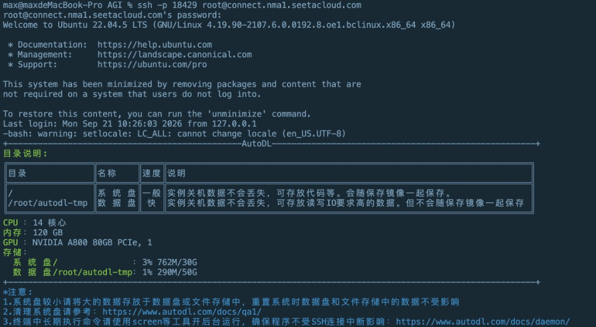

敲完 `df`、`nvidia-smi`、`which python3`、`python3 --version`：

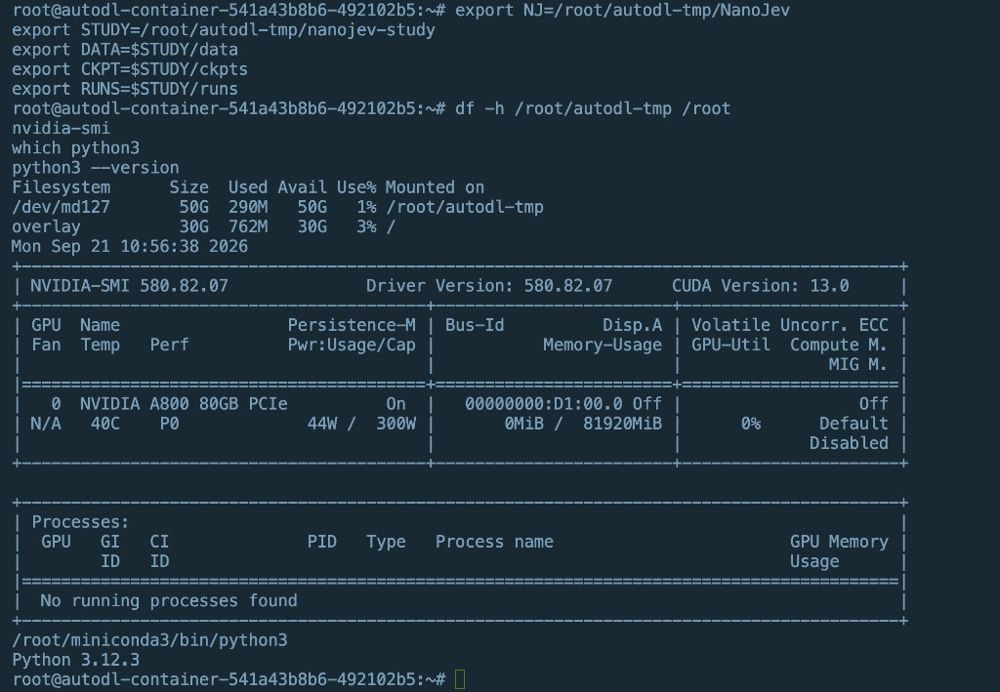

```
时间：2026-09-21 10:56

数据盘 /root/autodl-tmp：50G，总占用 290M，可用约 50G。
系统盘 /：30G，总占用 762M，可用约 30G。

GPU：NVIDIA A800 80GB PCIe，1 张。
驱动：580.82.07；nvidia-smi 显示 CUDA 13.0。
显存：0 MiB / 81920 MiB，当时没有其他 GPU 进程。

python3：/root/miniconda3/bin/python3
Python：3.12.3

结论：磁盘空间足够开始；GPU 空闲；Python 可用。阶段 0.1 通过。
```

#### 0.2 目录

```bash
mkdir -p "$STUDY"/{notes,data,ckpts,runs}
ls -la "$NJ" | head
ls -la "$STUDY"
```

我看到的：

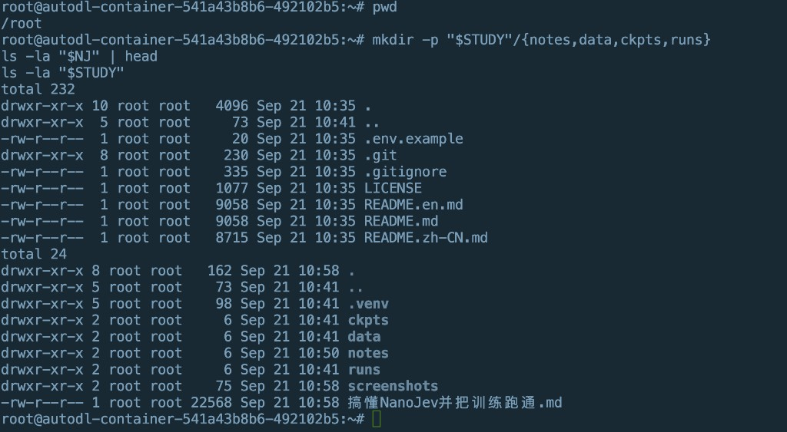

```
时间：2026-09-21 10:58

$NJ = /root/autodl-tmp/NanoJev，仓库在，含 .git、README、LICENSE。
$STUDY = /root/autodl-tmp/nanojev-study，已有：
  .venv、ckpts、data、notes、runs、screenshots
  搞懂NanoJev并把训练跑通.md

结论：目录齐了。代码仓是助手先 clone 的，我接着用。阶段 0.2 通过。
```

#### 0.3 虚拟环境

接着用现成的：

```bash
source "$STUDY/.venv/bin/activate"
python -V
which python
```

或者我自己重建：

```bash
rm -rf "$STUDY/.venv"
python3 -m venv "$STUDY/.venv"
source "$STUDY/.venv/bin/activate"
python -m pip install -U pip
python -V
```

我看到的：

```
时间：2026-09-21 10:59

没有重建环境，接着用现成 .venv。
source 之后提示符变成 (.venv)。
python -V：Python 3.12.3
which python：/root/autodl-tmp/nanojev-study/.venv/bin/python

结论：虚拟环境激活成功。阶段 0.3 通过。
```

#### 0.4 按配方装包

配方在 `$NJ/requirements-toy.txt`：torch 2.14.0、transformers 5.17.0、safetensors 0.8.0、numpy 2.5.3。另外再装 `huggingface_hub`。上游实验机是 Python 3.14.4；我这台是 3.12.3。清华源有 `torch-2.14.0-cp312-...x86_64.whl`（554.6 MB），和 PyPI 是同一个包。PyTorch 2.14 的默认 Linux wheel 依赖 CUDA 13.0，对得上这台机的驱动。

AutoDL 把 pip 默认源钉在阿里云，大 wheel 只有大约 140 kB/s。清华源 `pypi.tuna.tsinghua.edu.cn` 从这台容器访问返回 **HTTP 403**，所以 pip 报 `from versions: none`，不是没有 2.14.0。中科大源这台机能通，索引里也有 `torch==2.14.0`。

先确认提示符仍是 `(.venv)`，再敲：

```bash
python -m pip install -i https://mirrors.ustc.edu.cn/pypi/simple \
  --trusted-host mirrors.ustc.edu.cn \
  -r "$NJ/requirements-toy.txt" huggingface_hub
```

还会顺带拉 `cuda-toolkit`、`nvidia-cudnn-cu13`、`triton` 这些 CUDA 依赖，总下载比 554 MB 更大。速度还慢就停下来贴输出。

我看到的：

```
第一次（阿里云，已中止）：
Looking in indexes: http://mirrors.aliyun.com/pypi/simple
torch-2.14.0-cp312-cp312-manylinux_2_28_x86_64.whl 554.6 MB
大约 140 kB/s，eta 1 小时。
原因：AutoDL 默认 pip 源是阿里云，大文件限速/拥堵。

第二次（清华源，失败）：
https://pypi.tuna.tsinghua.edu.cn/simple
ERROR: No matching distribution found for huggingface_hub / torch==2.14.0
from versions: none
原因：这台 AutoDL 容器访问清华 PyPI 返回 HTTP 403，索引是空的。
处理：改用中科大 https://mirrors.ustc.edu.cn/pypi/simple，本机探测 200，且有 torch 2.14.0。

第三次（中科大，成功）：
https://mirrors.ustc.edu.cn/pypi/simple
大包速度大约 40–190 MB/s。
Successfully installed：
  torch-2.14.0
  transformers-5.17.0
  safetensors-0.8.0
  numpy-2.5.3
  huggingface_hub-1.32.0
  triton-3.8.0
  cuda-toolkit-13.0.3.0
  nvidia-cudnn-cu13-9.24.0.43
配方四个版本对齐。还差：Python 是 3.12.3，官方实验机是 3.14.4。
阶段 0.4 通过。
这次装进来的每个包是什么、干什么：见 [这次pip装进来的包是干什么的](这次pip装进来的包是干什么的.md)。
```

中科大源装完时的终端：

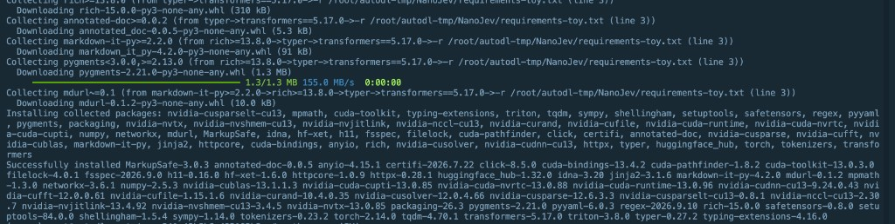

#### 0.5 我怎么知道环境好了

```bash
python - <<'PY'
import torch, transformers, safetensors, numpy
print("python", __import__("sys").version.split()[0])
print("torch", torch.__version__)
print("cuda", torch.cuda.is_available(), torch.cuda.get_device_name(0) if torch.cuda.is_available() else None)
print("bf16", torch.cuda.is_bf16_supported() if torch.cuda.is_available() else None)
print("transformers", transformers.__version__)
print("safetensors", safetensors.__version__)
print("numpy", numpy.__version__)
PY
```

过关：`cuda` 是 True。

我看到的：

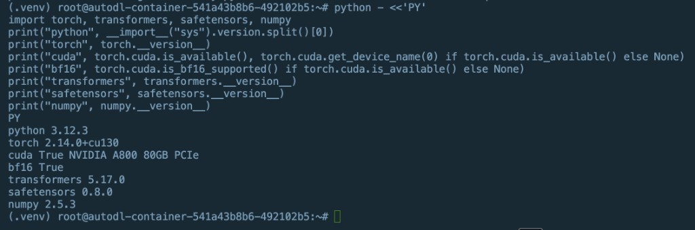

```
python 3.12.3
torch 2.14.0+cu130
cuda True NVIDIA A800 80GB PCIe
bf16 True
transformers 5.17.0
safetensors 0.8.0
numpy 2.5.3
阶段 0.5 通过。阶段 0 整段通过。
```

跟配方不一样的地方：

```
Python 3.12.3（官方实验机 3.14.4）
torch 打印成 2.14.0+cu130：版本还是 2.14.0，+cu130 表示绑的是 CUDA 13.0，和配方一致。
```

### 阶段 1 · 读代码，看一道题是怎么变成概率的（不用 GPU）

这步不跑模型。我只读三份东西，搞懂「请求进来之后，模型到底在比什么」。推理放到阶段 4。

先把几个词换成大白话，不然对着代码会晕：


| 文档里写的              | 人话                                                 |
| ------------------ | -------------------------------------------------- |
| **state**          | 眼前这份情况。例题里就是那段「客户被扣了两次款」。                          |
| **question**       | 我就这份情况问的一道题。一次可以问好几道。                              |
| **Choice**         | 选择题。选项名单我定死，模型不许自己编第四个。                            |
| **Boolean / Noul** | 是非题。只问「这句话成立吗」，要一个 0 到 1 的「是」的把握。                  |
| **Score**          | 打分题。档位是有顺序的，比如「没事 → 小问题 → 核心受阻 → 全挂」。              |
| **candidate / 路径** | 某一个选项被拼成的一整段文字，拿去给模型打分。一道选择题有几个选项，就有几条路径。          |
| **分数 / logit**     | 模型给这条路径打的原始分，可正可负，还不是百分比。                          |
| **softmax**        | 把这几个分数拧成「加起来等于 1」的概率。谁分高，谁占比大。                     |
| **分母**             | softmax 底下那个求和。聊天模型是对着几万个词加总；这里只对着**这道题的那几个选项**加总。 |


例题在 `$NJ/research/toy_inference_example.json`。第一份状态是退款客服，里面三道题刚好覆盖三种题型：

1. **team，Choice**：负责的组是账户、账单，还是技术？三个选项。
2. **paid，Boolean**：退款是不是已经到账了？是或否。
3. **impact，Score**：影响落在哪一档？四档文字，从「功能正常」到「彻底中断」。

聊天模型会怎么干：把题当聊天，然后一个字一个字往外写「我觉得是账单组」。这里不这么干。它给每个选项各拼一段字，**一次算完所有选项的分数**，再只在这些选项上把分数变成概率。一个字都不生成。

选择题 `team` 会变成三条差不多的句子，差别只在最后那个选项：

```text
State:
客户反映同一订单被扣款两次。...
Question type: choice
Question:
根据客户提出的主要问题，选择负责的支持团队。
Candidate:
billing: 扣费、付款与退款问题
Decision:
```

账户组、技术组各再来一条。模型给三条各打一个分，比如 1.2、4.8、0.3。softmax 不是对着词表，而是对着这三个数：

```text
billing 的概率 = e^4.8 / (e^1.2 + e^4.8 + e^0.3)
```

底下那一串相加，就是「分母」：只有这道题的选项，没有「下一个字是什么」那几万个词。所以模型再喜欢写「嗯，让我想想」，也吐不出来——那个词根本不在分母里。

是非题更省：代码常常**只拼一条**「这句话为真」的路径，打出一个分 `z`。「为假」不另走一遍，直接把假的分数钉成 0。两个数再做一次 softmax，得到「是」的概率。

打分题的档位是有顺序的。如果我把「第 3 档」这个数字写进输入，模型可能去认数字大小，而不是认「核心功能受阻」这句话。所以输入里只放档位的文字，不放 0、1、2、3。

---

终端里按这个顺序看。提示符仍是 `(.venv)`。

**先看请求长什么样。** 盯 `team` / `paid` / `impact` 三种 `type`，以及 Choice 的选项是一个对象（`account`、`billing`、`technical`），Score 的档位是一个数组（有顺序）。

```bash
nl -ba "$NJ/research/toy_inference_example.json"
```

**再看怎么把一道题拆成几条路径。** `prepare_examples`：Choice 每个选项一条；Boolean 默认只留「为真」那一句；Score 每档一条，用的是档位文字。`answer_from_probabilities`：拿到概率之后，Choice 取最大的那个键，Boolean 给出 `p_true`，Score 再算一个期望档位。

```bash
sed -n '85,146p' "$NJ/scripts/predict_toy_decisions.py"
```

**最后看分数怎么算、损失怎么算。** `DecisionModel.forward`：所有路径一次进骨干，每条路径最后一个位置出一个数。Choice 还会用选项之间的注意力互相看一眼。Boolean 那两行把假钉成 0。`loss_for` 最后那个 `log_softmax(-1)`：`-1` 表示在「这一题的几个选项」这个方向上做 softmax，不是对着词表。

```bash
sed -n '104,153p' "$NJ/scripts/train_toy_decisions.py"
```

看完用自己的话写三句，对照例题写，别抄前面章节：

1. 退款这道 `team` 选择题，三个分数变成概率时，底下相加的是谁？
2. `paid` 是非题，代码为什么常常只走一条路径？「否」的分数从哪来？
3. `impact` 打分题，为什么输入里只放「核心功能受阻……」，不放「这是第 3 档」？

我的理解：

```
1. team 选择题三个分数做 softmax 时，底下相加的只是 account / billing / technical 这三个选项的 e^分数，不是词表里那几万个词。所以模型再想写「嗯让我想想」也吐不出来——那个词根本不在分母里。
2. paid 是非题常常只拼「为真」那一条路径，打出一个分 z；「为假」不另走一遍，代码直接把假的分数钉成 0，再和 z 做一次两档 softmax，得到 p_true。
3. impact 打分题如果把「第 3 档」这种序号写进输入，模型可能去认数字大小，而不是认「核心功能受阻」这句话；所以输入里只放档位文字，不放 0/1/2/3。
```

（2026-09-21 阶段 7 补完。对照例题和阶段 4 玩具推理对过一遍。）

### 阶段 2 · 起个本地网页，看已经录好的对局（不用 GPU）

这步**不是**让模型现场推理。仓库 `web/` 里已经躺着录好的回放：画面、每一步问了什么、每个选项的概率、实际按下的键。我只是把这些 JSON 用浏览器播出来。

三个并排窗口一般是：

- **Jev**：TypeSafe 那个商业模型（他们录下来的）
- **NanoJev**：0.6B 那个仿制品，统一权重大约第 400 步
- **Untuned Qwen**：没加决策头、没在这四个游戏上练过的原版小模型

我要分清三件事，别看成「模型在自己玩游戏」：

1. **彩色条 / 概率**：模型的判断。「往左 / 往右 / 开火」各多少把握。
2. **实际按下的键**：控制器（一段普通代码）拿着这些概率去选动作。概率最大的那个，不一定就是按下的那个。
3. **迷宫多出来的记路**：模型只看眼前几条边安不安全；「走过哪、怎么绕回来」是代码在记账。只剩一个合法方向时，那一步是代码逼出来的，不是模型选的。

看的时候放慢，盯一条概率条和「实际动作」是不是同一边。

---

新开终端先确认路径还在（没有 `$NJ` 就先敲阶段 0 那几行 `export`）。这个小网页不需要 `.venv`，系统自带的 `python3` 就行。

这台是 AutoDL，**没有独立公网 IP**。仓库 README 写的 `127.0.0.1:8080` 只在容器内部有效：我在自己电脑浏览器里敲这个地址，连的是笔记本，连不上 GPU 机。AutoDL 只把容器里的 **6006**（以及 6008）映射到公网。这台机的 6006 地址在环境变量 `AutoDLService6006URL` 里，控制台「自定义服务」也能复制。

所以端口改成 6006，绑到 `0.0.0.0`（让 AutoDL 的反向代理进得来）：

```bash
echo "$AutoDLService6006URL"
cd "$NJ"
python3 -m http.server 6006 --bind 0.0.0.0 --directory web
```

终端里应出现 `Serving HTTP on 0.0.0.0 port 6006`。这个窗口别关。

访问有两条路，能开就行：

1. **Cursor 端口转发**（这次实际走通的）：浏览器开 `http://localhost:6006/...`。这是 Cursor 把容器的 6006 转到你电脑上，不是 AutoDL 公网。
2. **AutoDL 自定义服务**：用 `echo "$AutoDLService6006URL"` 那个 `https://...seetacloud.com:8448/...`。

为什么 Mac 的 Chrome 里敲 `localhost:6006` 能看到 GPU 机上的网页？

`localhost` 永远是「我正在用的这台电脑」。Chrome 连的确实是 **Mac 自己的 6006**，不是直接连 AutoDL。真正在 AutoDL 上跑的是 `python3 -m http.server`。中间多了一截 Cursor 自动建的 SSH 隧道：

```text
Mac Chrome
  → 连 Mac 的 127.0.0.1:6006     （Cursor 在 Mac 上听这个口）
  → 字节从 SSH 送到 AutoDL
  → AutoDL 里 python 在 6006 上的网页
```

所以地址栏写着 localhost，页面却是远端的。Cursor 连着这台机的时候隧道才在；Cursor 断开、或者把 Ports 里 6006 那条删掉，Chrome 立刻打不开。助手也在这台 AutoDL 上，但浏览器流量不经过助手，只经过你的 Cursor。

Cursor 底栏 Ports 能看到 Forwarded 的 6006。AutoDL 控制台那条 `seetacloud.com` 是另一条路：公网反代，不经过 Mac 的 localhost。

根路径 `/` 是 **Lab**：更早的迷宫实验回放，下拉框里那些 V3 / checkpoint 不是我们后面要训的 unified-games。阶段 2 要看的是 `/dev/` 里三家并排的对局。

浏览器打开：

- Basic（打怪）：[http://localhost:6006/dev/?autoplay=1](http://localhost:6006/dev/?autoplay=1)
- 迷宫：[http://localhost:6006/dev/side-by-side.html?autoplay=1#maze](http://localhost:6006/dev/side-by-side.html?autoplay=1#maze)

若 localhost 打不开，把前面换成自定义服务那个 https 地址，路径保持 `/dev/...`。

迷宫页上有 Maze / Snake 切换。Basic 页可以再点 Predict Position。

网页打不开（空白、JSON 加载失败、连不上、502）：先停，把终端和浏览器报错贴回来。别急着改端口乱试。看完在跑服务的那个终端 Ctrl+C 停掉。

看完用几句话记下：三个窗口谁先到、概率条和实际按键有没有打架、迷宫是不是明显在绕路而不是每步都问模型。

我看到的：

已经能打开网页。实际入口是 Cursor 转到本机的 `http://localhost:6006`，不是只能走 AutoDL 公网。

先打开的是根路径 Lab，不是 `/dev/` 对局：

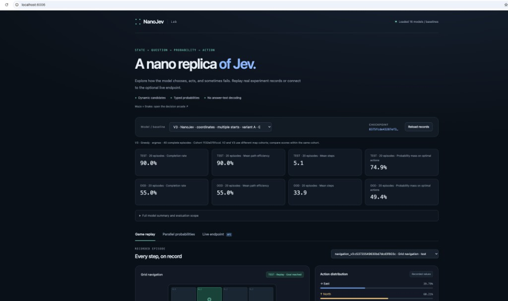

```
Lab 标题：A nano replica of Jev.
Loaded 16 models / baselines
当前条目：V3 · NanoJev · coordinates · multiple starts · variant A
TEST 完成率 90.0%；这一步动作分布 East 31.7%、North 68.2%
这是更早一批迷宫实验的录像，不是 unified 四个游戏那套。
下一步改开 /dev/ 两个地址。
```

已经打开 `/dev/` 的 Basic 三家对打页：

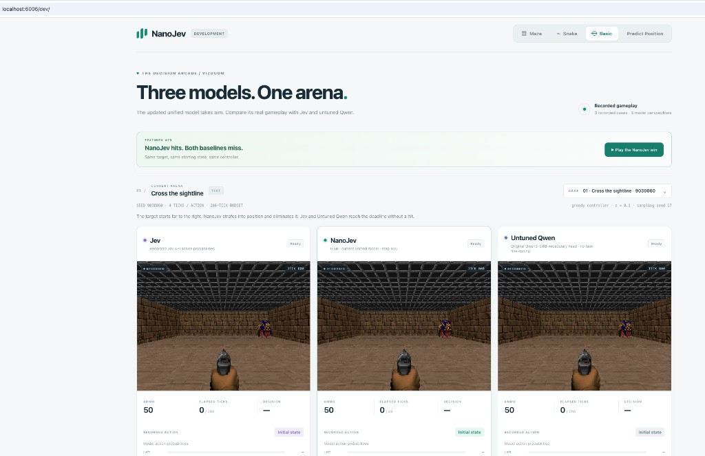

```
地址：http://localhost:6006/dev/
标题：Three models. One arena.
案子：01 Cross the sightline（TEST）
三列：Jev · NanoJev（unified · step 400）· Untuned Qwen
这一帧还是 Initial state，弹药 50，elapsed 0。绿条写 NanoJev hits. Both baselines miss.
这是录好的回放，不是这台 A800 正在推理。点 Play the NanoJev win 才会动。
迷宫页还没看。
```

播完 Basic，又看了迷宫、蛇、打移动靶。阶段 2 通过。

Basic 播完（Cross the sightline）：

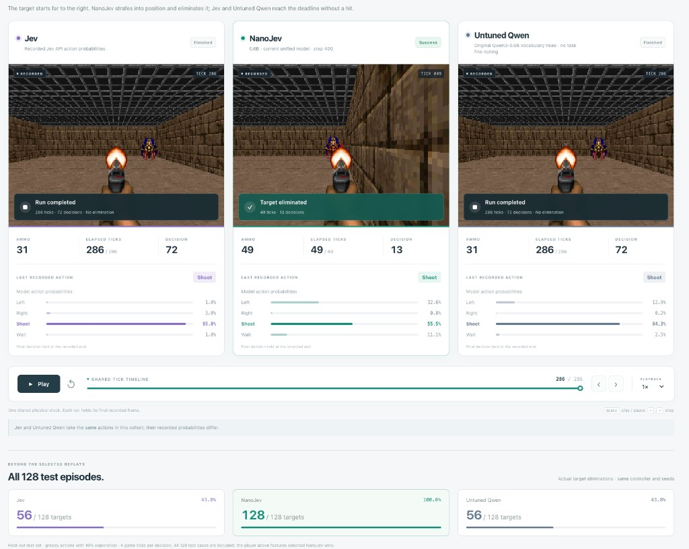

```
NanoJev：Success，49 ticks / 13 次判断，弹药还剩 49。
Jev、Untuned Qwen：Finished，都是 286 ticks / 72 次判断，没打中，弹药 31。
页脚写明：这一组对照里 Jev 和 Qwen 按的键一样，只是概率条不一样。
最后一帧三家都是 Shoot：Jev 95.0%，NanoJev 55.5%，Qwen 84.3%。
底下 128 局测试：NanoJev 128/128，Jev 和 Qwen 都是 56/128。
```

迷宫（50×50，三家都到终点）：

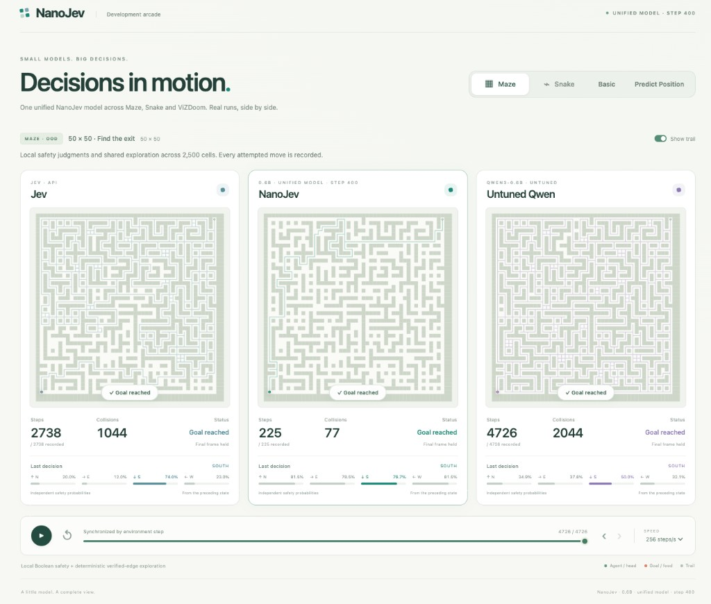

```
NanoJev 225 步、77 次撞墙。Jev 2738 步、1044 次撞。Qwen 4726 步、2044 次撞。
页脚：Local Boolean safety + deterministic verified-edge exploration。
概率条是四个方向各自安不安全（Independent safety probabilities），不是四个方向加起来等于 100%。
绕路、回头，是代码在记走过的边；模型只判眼前。
```

蛇（12×12）：

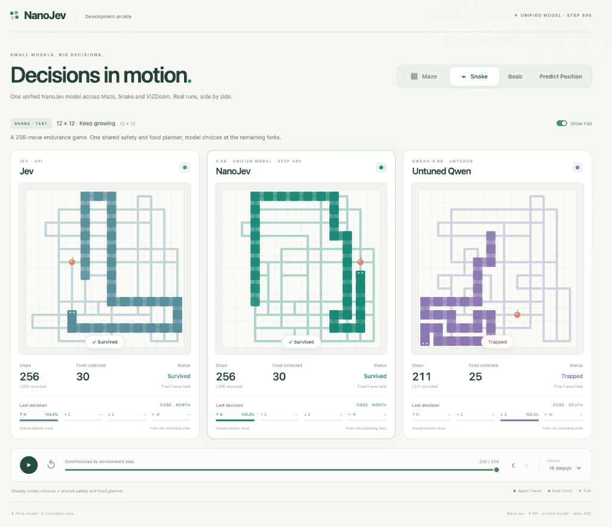

```
Jev、NanoJev：256 步，30 个食物，Survived。
Untuned Qwen：211 步，25 个食物，Trapped。
最后一步标着 CODE NORTH / CODE SOUTH，100%，Shared planner move。
只剩一个合法方向时，是规划器逼出来的，不是模型在几个选项里选。
```

打移动靶（Wait for the window）：

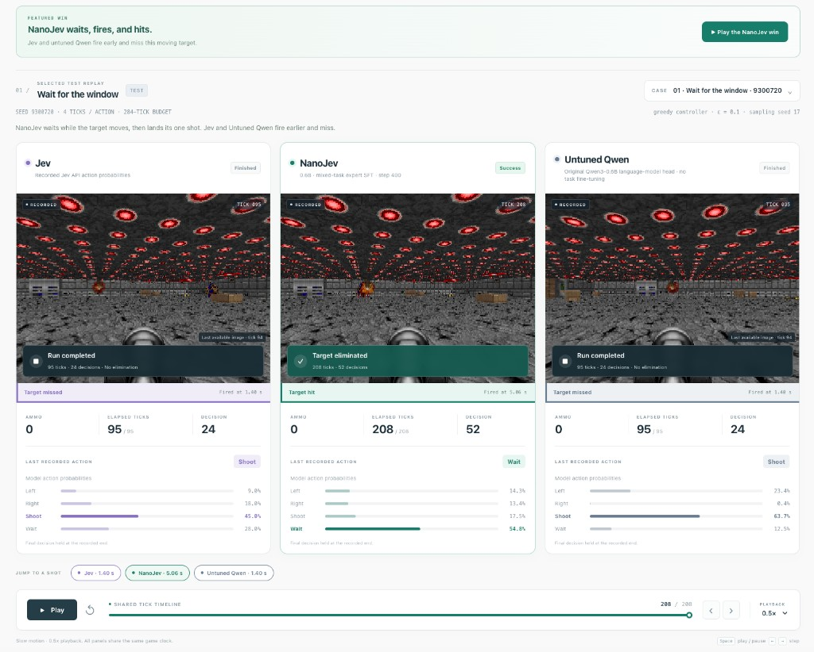

```
NanoJev：Target hit，5.06s，208 ticks / 52 次判断，最后一动是 Wait 54.8%。
Jev：1.60s 开枪打空。Qwen：1.48s 开枪打空。
同一套控制器，差在会不会等。
```

一句话：画面是游戏，彩色条是模型给的概率，真正按键是控制器；迷宫绕路和蛇的 CODE 步是代码，不是模型在写字。

### 阶段 3 · 把数据拉下来，拆四条样本

我这台 AutoDL 直连 `huggingface.co` 会 `Network is unreachable`。内蒙这台的 `/etc/network_turbo` 只提示用三方镜像，**不会**开代理。所以下载前我要设镜像，并关掉 `hf_xet`——它可能绕过镜像又去连官方。

```bash
export HF_ENDPOINT=https://hf-mirror.com
export HF_HUB_DISABLE_XET=1
export DATA=/root/autodl-tmp/nanojev-study/data
source "$STUDY/.venv/bin/activate"
python - <<'PY'
from huggingface_hub import snapshot_download
snapshot_download(
    repo_id="C-Tianyu/NanoJev-Data",
    repo_type="dataset",
    revision="unified-games-v1",
    local_dir="/root/autodl-tmp/nanojev-study/data/NanoJev-unified",
)
print("done")
PY
find "$DATA/NanoJev-unified" -maxdepth 3 -type d | head -50
```

`HF_ENDPOINT` 必须在启动 python **之前** export，import 之后再设就无效。这个终端我关掉就要再 export 一次。整包大约 800MB，277 个文件；我匿名走镜像容易 429。阶段 6 我真正要用的是 `unified/hard/`（train 约 68MB）。若全量被限流，我就改只拉这一份：

```bash
export HF_ENDPOINT=https://hf-mirror.com
export HF_HUB_DISABLE_XET=1
export DATA=/root/autodl-tmp/nanojev-study/data
python - <<'PY'
from huggingface_hub import snapshot_download
snapshot_download(
    repo_id="C-Tianyu/NanoJev-Data",
    repo_type="dataset",
    revision="unified-games-v1",
    local_dir="/root/autodl-tmp/nanojev-study/data/NanoJev-unified",
    allow_patterns=["unified/hard/*"],
    max_workers=1,
)
print("done")
PY
ls -lh "$DATA/NanoJev-unified/unified/hard"
```

目录出来之后，我从 `unified/hard/train.jsonl` 里各抽一条迷宫、蛇、Basic、打移动靶。整行 json 太长，我不贴；我只要状态前几行、问题、选项、teacher 给的概率。

```bash
python - <<'PY'
import json
from pathlib import Path
path = Path("/root/autodl-tmp/nanojev-study/data/NanoJev-unified/unified/hard/train.jsonl")

def kind(row):
    st = row.get("state")
    if isinstance(st, str) and st.startswith("Maze"):
        return "maze"
    if isinstance(st, str) and st.startswith("Snake"):
        return "snake"
    if isinstance(st, str) and st.lstrip().startswith("{"):
        try:
            obj = json.loads(st)
        except json.JSONDecodeError:
            return None
        return obj.get("scenario")  # basic / predict_position
    return None

def preview(state):
    if isinstance(state, str) and state.lstrip().startswith("{"):
        obj = json.loads(state)
        keys = ("scenario", "goal", "tick", "ammo", "target")
        return {k: obj.get(k) for k in keys if k in obj} or str(obj)[:400]
    return "\n".join(state.splitlines()[:8])

need = ["maze", "snake", "basic", "predict_position"]
found = {}
for line in path.open():
    row = json.loads(line)
    k = kind(row)
    if k in need and k not in found:
        qid, q = next(iter(row["questions"].items()))
        teacher = (row.get("teacher") or {}).get("native_probs") or (row.get("teacher") or {}).get("probs") or row.get("teacher")
        found[k] = dict(id=row.get("id"), family=row.get("family_id"),
                        task=(row.get("metadata") or {}).get("task"),
                        qid=qid, qtype=q.get("type"), instructions=q.get("instructions"),
                        criteria=q.get("criteria"), teacher=teacher,
                        state=preview(row.get("state")))
    if len(found) == 4:
        break
print(json.dumps(found, ensure_ascii=False, indent=2))
print("train_lines", sum(1 for _ in path.open()))
PY
```

我看到的：

```
第一次我直连 huggingface.co，失败：
httpx.ConnectError: [Errno 101] Network is unreachable
huggingface_hub.errors.LocalEntryNotFoundError
find: NanoJev-unified: No such file or directory
不是要登录。是这台容器到 huggingface.co 的 TCP 不通。
我改走 HF_ENDPOINT=https://hf-mirror.com，并 HF_HUB_DISABLE_XET=1。
内蒙这台 source /etc/network_turbo 没用，它提示该地区学术加速暂未支持。

第二次走 hf-mirror，被 429 掐断：
Fetching 277 files: 193/277，约 615MB。
HTTP 429 Too Many Requests：镜像对匿名并发限流。
落到盘上的大多是 evaluation / demonstrations / games_v4，训练要的 unified/hard/*.jsonl 当时还没有。
本想改成只拉 unified/hard、max_workers=1。

第三次我把原来那条全量命令又跑了一遍，续传成功：
Fetching 277 files: 100%，大约 8 秒把缺的补完，done。
unified/hard/train.jsonl 66MB，10898 行。
find | head -50 没看到 unified，只是列表被截断了，文件其实在。

我后来还是登录了 Hugging Face：
hf auth login 成功。token 在 /root/.cache/huggingface/token。
当前这条 token 名叫 oauth-tiantianaimax，oauth，过期会自动刷新。
token 本体我不往对话里贴。
```

四条 train 样本我抽出来了。train 一共 10898 行。四道题都是 Choice，问题 ID 都叫 action，instructions 几乎同一句：选下一步，好在截止前把任务做完。

终端里长这样：

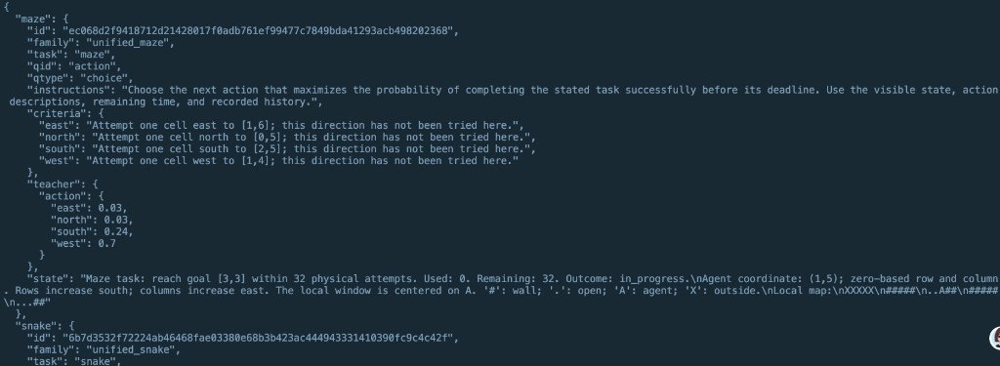

```
迷宫 unified_maze：四个方向。teacher 概率 west 0.7、south 0.24、east/north 各 0.03。hard 这轮训练会拿最大的那个当答案，也就是 west。状态是文字地图，A 在 (1,5)，目标 [3,3]。

蛇 unified_snake：只有 east/north/south 三个选项，没有西——反方向不让走。teacher 里 east 0.87。

Basic 和打移动靶都归在 family unified_shooting，task 也是 shooting。脚本当时打印 teacher: null，不是没标签：射击行没有 teacher 字段，标签在 expert.policy_probs 和 gold.action。Basic 这条 gold 是 right，专家几乎 1.0 给 right；打移动靶这条 gold 是 noop（等着）。Basic 的选项是左右平移，打移动靶是左右转身，都带 wait 和 shoot。

我怎么记：这一份 hard 数据，每一行就是「当前看得见的状态 + 几个动作选项 + 专家更想选哪个」。不是让模型写一段攻略。
```

阶段 3 我下的是**训练用的数据**，不是模型权重。

仓库是 Hugging Face 上的 [C-Tianyu/NanoJev-Data](https://huggingface.co/datasets/C-Tianyu/NanoJev-Data)，版本 `unified-games-v1`。`C-Tianyu` 就是 GitHub 上 NanoJev 的作者陈天宇。他把迷宫、蛇、ViZDoom Basic、打移动靶配对好的监督数据公开在这儿，我用镜像拷到本机 `/root/autodl-tmp/nanojev-study/data/NanoJev-unified`。

里面东西很多（评测、录像、旧实验），阶段 6 我真正喂给训练脚本的是 `unified/hard/`：`train.jsonl` 10898 行，加上 dev / test 那些。每一行是「当时看见的状态 + 几个动作 + 专家更想选哪个」。

权重是另一个仓库 [C-Tianyu/NanoJev](https://huggingface.co/C-Tianyu/NanoJev)，那是阶段 4：已经训好的 checkpoint，以及我自己开训要用的初始化。

### 阶段 4 · 先加载官方权重，打一次推理

这是陈天宇另一个仓库 [C-Tianyu/NanoJev](https://huggingface.co/C-Tianyu/NanoJev)，版本还是 `unified-games-v1`。我要下两份：

- `NanoJev-unified`：已经训好的统一模型（大约第 400 步），用来当场打一次推理。
- `NanoJev-init/training_initialization`：开训用的初始化权重。文档里 SHA256 是 `38116340795de1c82369b7fe15819d92d79600a7b4dc7a3cd0d4390cb6782639`。

数据盘还有大约 44G，这两份 0.6B 权重够放。6006 还被阶段 2 的静态网页占着，我别去抢；推理服务用 8765，在 **AutoDL 这台机自己的终端** 里 curl `127.0.0.1` 就行，不用开 Mac 浏览器。

`(.venv)` 还在的话，镜像和路径仍要再 export 一次。初始化目录有嵌套的 tokenizer，`allow_patterns` 要用 `**`，不然只下到一层。

#### 4.1 下载权重

```bash
export HF_ENDPOINT=https://hf-mirror.com
export HF_HUB_DISABLE_XET=1
export CKPT=/root/autodl-tmp/nanojev-study/ckpts
python - <<'PY'
from huggingface_hub import snapshot_download
snapshot_download(
    repo_id="C-Tianyu/NanoJev",
    revision="unified-games-v1",
    local_dir="/root/autodl-tmp/nanojev-study/ckpts/NanoJev-unified",
    allow_patterns=["best.safetensors", "config.json", "tokenizer/**", "backbone_config/**"],
    max_workers=1,
)
snapshot_download(
    repo_id="C-Tianyu/NanoJev",
    revision="unified-games-v1",
    local_dir="/root/autodl-tmp/nanojev-study/ckpts/NanoJev-init",
    allow_patterns=["training_initialization/**"],
    max_workers=1,
)
print("done")
PY
ls -lh "$CKPT/NanoJev-unified" "$CKPT/NanoJev-init/training_initialization"
```

看到 `done` 和两个目录的文件，再核 SHA。又 429 就先停。

我看到的：

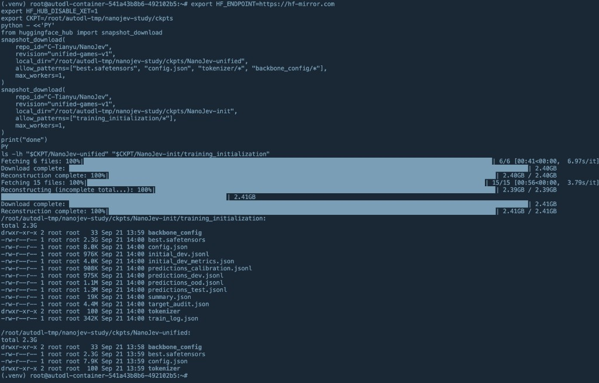

```
Fetching 6 files: 100%| 6/6 [00:41<00:00, 6.97s/it]
Download complete: 2.40GB
Reconstruction complete: 2.40GB / 2.40GB
Fetching 15 files: 100%| 15/15 [00:56<00:00, 3.79s/it]
Download complete: 2.41GB
Reconstruction complete: 2.41GB / 2.41GB
done

/root/autodl-tmp/nanojev-study/ckpts/NanoJev-init/training_initialization:
total 2.3G
drwxr-xr-x 2 root root   33 Sep 21 13:59 backbone_config
-rw-r--r-- 1 root root 2.3G Sep 21 14:00 best.safetensors
-rw-r--r-- 1 root root 8.0K Sep 21 14:00 config.json
-rw-r--r-- 1 root root 976K Sep 21 14:00 initial_dev.jsonl
-rw-r--r-- 1 root root 4.0K Sep 21 14:00 initial_dev_metrics.json
-rw-r--r-- 1 root root 908K Sep 21 14:00 predictions_calibration.jsonl
-rw-r--r-- 1 root root 975K Sep 21 14:00 predictions_dev.jsonl
-rw-r--r-- 1 root root 1.1M Sep 21 14:00 predictions_ood.jsonl
-rw-r--r-- 1 root root 1.3M Sep 21 14:00 predictions_test.jsonl
-rw-r--r-- 1 root root  19K Sep 21 14:00 summary.json
-rw-r--r-- 1 root root 4.4M Sep 21 14:00 target_audit.json
drwxr-xr-x 2 root root  100 Sep 21 14:00 tokenizer
-rw-r--r-- 1 root root 342K Sep 21 14:00 train_log.json

/root/autodl-tmp/nanojev-study/ckpts/NanoJev-unified:
total 2.3G
drwxr-xr-x 2 root root   33 Sep 21 13:58 backbone_config
-rw-r--r-- 1 root root 2.3G Sep 21 13:59 best.safetensors
-rw-r--r-- 1 root root 7.9K Sep 21 13:59 config.json
drwxr-xr-x 2 root root  100 Sep 21 13:59 tokenizer
```

第一段 6 个文件是已经训好的统一模型，第二段 15 个文件是开训用的初始化。两份 `best.safetensors` 都是 2.3G。我实际敲的是 `tokenizer/*` 不是 `**`，嵌套的 tokenizer 仍然齐。4.1 通过。

#### 4.2 核对初始化 SHA

```bash
sha256sum "$CKPT/NanoJev-init/training_initialization/best.safetensors"
```

应对上 `38116340795de1c82369b7fe15819d92d79600a7b4dc7a3cd0d4390cb6782639`。

我看到的：

```
38116340795de1c82369b7fe15819d92d79600a7b4dc7a3cd0d4390cb6782639  .../training_initialization/best.safetensors
```

和文档里写的初始化权重一致。4.2 通过。

#### 4.3 起推理服务（另开终端）

新终端要重新 `source` venv，并 export `NJ`、`CKPT`。这个会占 GPU，窗口别关。

```bash
source /root/autodl-tmp/nanojev-study/.venv/bin/activate
export NJ=/root/autodl-tmp/NanoJev
export CKPT=/root/autodl-tmp/nanojev-study/ckpts
cd "$NJ"
CUDA_VISIBLE_DEVICES=0 python scripts/serve_decisions.py \
  --checkpoint-dir "$CKPT/NanoJev-unified" \
  --web-root web --host 127.0.0.1 --port 8765 --disable-native-triton
```

看到打印出 `ready` 和 `http://127.0.0.1:8765` 再打请求。

我看到的：

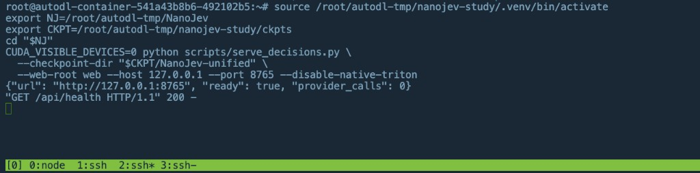

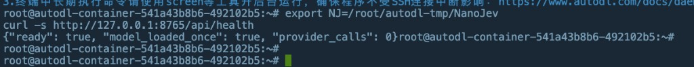

```
服务端：{"url": "http://127.0.0.1:8765", "ready": true, "provider_calls": 0}
随后日志："GET /api/health HTTP/1.1" 200 -
curl：{"ready": true, "model_loaded_once": true, "provider_calls": 0}
模型只加载了一次，没有去调外面的 API。
```

4.3 通过。

#### 4.4 打一条玩具请求（再开一个终端）

这个 curl 在 AutoDL 容器里访问自己，不是 Mac 上的 localhost。

```bash
export NJ=/root/autodl-tmp/NanoJev
curl -s http://127.0.0.1:8765/api/health
curl -s http://127.0.0.1:8765/api/evaluate \
  -H 'Content-Type: application/json' \
  --data-binary @"$NJ/research/toy_inference_example.json"
```

我在返回里找：有没有生成字（应该是 0）、问了几道题、几条候选路径、每道题的概率。整份超长 JSON 不用全贴。看完在跑服务的那个终端 Ctrl+C。

我看到的：

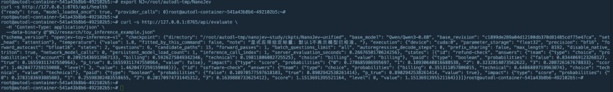

```
checkpoint: Qwen/Qwen3-0.6B + set_head=attention
device cuda:0，bf16，约 0.27 秒
states 2，questions 6，candidate_paths 15
forward_passes 1，autoregressive_decode_steps 0  ← 一个字都没生成
network_model_calls 0，persistent_model_load_count 1

refund-check：
  team → billing 0.593（account 0.209，technical 0.198）
  paid → false，p_true 0.166
  impact → level 2，期望分约 1.46

software-check：
  team → technical 0.649（billing 0.351）
  paid → true，p_true 0.890
  impact → level 0，期望分约 1.15
```

和阶段 1 对上了：一次前向算完所有路径，只在各题自己的选项上出概率，不写字。4.4 通过。阶段 4 整段通过。

整份 JSON 太长，格式化版和逐项说明见文末：[附录 A · 玩具推理 JSON 怎么读](#appendix-a)。

#### 阶段 4 小结

阶段 4 整段已经完成。我做完的事：

1. 从 Hugging Face 拉下两份权重：已训好的 `NanoJev-unified`，以及开训用的初始化（SHA 对上文档）。
2. 在本机起了 `serve_decisions`（8765），GPU 上把模型装进内存。
3. 用玩具请求打了一次真正的推理，不是看录像。

达成的效果，用结果里的数字说：

- **不写字**：`autoregressive_decode_steps = 0`
- **一次算完**：2 份状态、6 道题、15 条路径，`forward_passes = 1`，大约 **0.27 秒**
- **吐的是概率**：Choice / Boolean / Score 各有分布；例如退款走账单组（billing ≈ 59%），软件走技术组（technical ≈ 65%）
- **不连外网模型**：`network_model_calls = 0`，权重只加载一次

所以阶段 4 证明的是：公开的统一 checkpoint 能在我这台 A800 上按 Jev 那套接口工作——状态进、选项上的概率出。阶段 2 是看别人录好的回放；阶段 4 是我自己的机器在算。

「玩具请求」是什么？就是仓库里那份很小的演示输入：`$NJ/research/toy_inference_example.json`。叫「玩具」，是因为：

- 不是阶段 3 里迷宫 / 蛇 / 射击那种训练数据
- 是作者手写的两段**客服场景**（退款被扣两次、软件按钮坏了），专门用来试接口
- 每段里塞了三种题：Choice（找哪个组）、Boolean（退款到没到账）、Score（影响有多严重）

4.4 用的 `curl ... --data-binary @"$NJ/research/toy_inference_example.json"`，就是把这份 JSON 丢给正在跑的服务。目的是先确认「模型能判题」，不必先上游戏状态。

### 阶段 5 · 训练空跑，先不更新权重

跑服务的那个终端可以 Ctrl+C 停掉，把 GPU 腾出来。空跑不更新权重，只检查 hard 数据能不能读进训练脚本。

```bash
source /root/autodl-tmp/nanojev-study/.venv/bin/activate
export NJ=/root/autodl-tmp/NanoJev
export DATA=/root/autodl-tmp/nanojev-study/data
cd "$NJ"
python scripts/train_unified_games.py \
  --input "$DATA/NanoJev-unified/unified/hard" \
  --stage sft --validate-only
```

我想看到：退出码 0，丢掉了多少坏标签，真正能训的题大概是不是一万条出头（文档写大约 10893）。

我看到的：

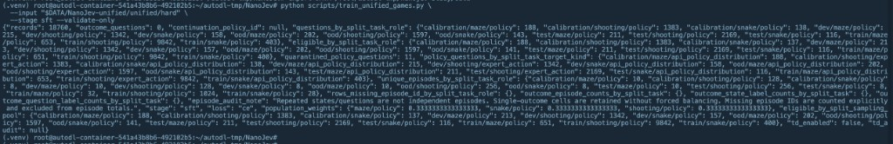

```
退出码 0（正常结束）。没有更新任何权重。

总题数 records: 18760（train/dev/test/calibration/ood 全加起来）
隔离坏标签 quarantined_policy_questions: 11

train 能训：
  maze 651 + shooting 9842 + snake 400 = 10893
  （和文档写的大约 10893 一致；原始 train 10898 行，丢掉 5 条）

dev 能训：maze 213 + shooting 1342 + snake 157 = 1712

标签种类：
  迷宫 / 蛇 → api_policy_distribution（teacher 分布）
  射击 → expert_action（专家动作）

抽样权：maze / snake / shooting 各约 1/3
td_enabled: false（这轮不是 TD）

阶段 5 通过。
```

整份空跑 JSON 太长，格式化版见文末：[附录 B · 训练空跑 JSON 怎么读](#appendix-b)。

#### 阶段 5 小结

阶段 5 是**开训前的对账**，不是真正训练。

我做了什么：对 hard 数据包跑 `--validate-only`。脚本把 train / dev / test / calibration / ood 里的题全扫一遍，检查标签能不能用，**不加载初始化权重去反传，也不写出新的 checkpoint**。

我确认了什么：

- 数据能被训练脚本读懂，退出码 0
- 全库约 18760 道题；标签不合格隔离 **11** 条
- **train 真正能训 10893**（迷宫 651 + 射击 9842 + 蛇 400），和文档写的约 10893 对上
- 三个任务抽样权各约 1/3；这轮是 SFT + 交叉熵，不是 TD

一句话：阶段 5 过了，说明「公开 hard 数据在我这台机上对得上配方」。下一步阶段 6 才真正开始改权重。

### 阶段 6 · 训练

正式 600 步要跑一阵，还占满一张 A800。我不想一上来就开长跑：万一路径写错、显存爆了、或者第一步就报错，损失的是时间和电费。所以我先用**同一条命令只跑 2 步**，看管线通不通；这 2 步过了，再开 600 步。

#### 6.1 先试跑 2 步

参数跟后面正式训一样，只是 `--steps 2`。我想确认三件事：脚本能正常结束、输出目录里出现了 `best.safetensors`、显存没有立刻炸。这三样有一样不行，我就先停下来查，**不接着开 600 步**。

命令前面的 `CUDA_VISIBLE_DEVICES=0`：只让程序看见 **0 号那张 GPU**。我这台机只有一张 A800，它就是 device 0。写上等于把「用这张卡」写死；不写多数时候也会默认用 0，多卡机器上更不容易搞错。

时间预期：2 步试跑一般是**几分钟**（常见大概 2～10 分钟）。大半时间在加载 2.3G 初始化、第一次编译算子；真正一步训练大约几秒。后面还有 step 2 和一次验证（`--eval-every 2`）。正式 600 步是另一档耗时，不是这条。

```bash
source /root/autodl-tmp/nanojev-study/.venv/bin/activate
export NJ=/root/autodl-tmp/NanoJev
export DATA=/root/autodl-tmp/nanojev-study/data
export CKPT=/root/autodl-tmp/nanojev-study/ckpts
export RUNS=/root/autodl-tmp/nanojev-study/runs
cd "$NJ"
CUDA_VISIBLE_DEVICES=0 python scripts/train_unified_games.py \
  --input "$DATA/NanoJev-unified/unified/hard" \
  --init-checkpoint "$CKPT/NanoJev-init/training_initialization" \
  --output-dir "$RUNS/hard_lr1e5_smoke" \
  --stage sft --loss ce \
  --steps 2 --eval-every 2 \
  --batch-questions 24 --microbatch-questions 8 \
  --max-microbatch-tokens 32768 --max-length 8192 \
  --backbone-lr 1e-5 --head-lr 1e-4 \
  --gradient-checkpointing --precision bf16 --seed 17 \
  --disable-native-triton
```

我看到的：

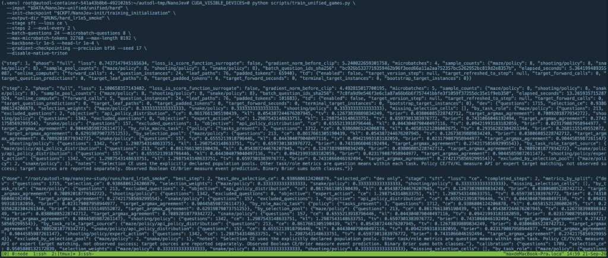

跑起来之后 GPU 利用率大约 97%，显存大约 10G / 80G。输出目录 `$RUNS/hard_lr1e5_smoke` 里先出现了 `config.json`、`tokenizer/`、`target_audit.json`，后来写出了 **`best.safetensors`（2.3G）**，还有 `train_log.json`、`predictions_dev.jsonl`。

step 1：

```
{"step": 1, "phase": "full", "loss": 0.7437147945165634, "loss_is_score_function_surrogate": false, "gradient_norm_before_clip": 5.240022659301758, "microbatches": 4, "sample_counts": {"maze/policy": 8, "shooting/policy": 8, "snake/policy": 8}, "sample_pool_counts": {"maze/policy": 8, "shooting/policy": 8, "snake/policy": 8}, "batch_question_ids_sha256": "bc926b5337719359462b96f3eed66a11a2aa752357bc5262952bc819d2e8357b", "elapsed_seconds": 5.364199489355087, "online_compute": {"forward_calls": 4, "question_instances": 24, "leaf_paths": 76, "padded_tokens": 65940}, "td": {"enabled": false}}
```

step 2（顺带做了一次 dev 验证）：

```
{"step": 2, "phase": "full", "loss": 1.100658357143402, "gradient_norm_before_clip": 4.492815017700195, "microbatches": 5, "sample_counts": {"maze/policy": 8, "shooting/policy": 8, "snake/policy": 8}, "elapsed_seconds": 13.265935715287924, "online_compute": {"forward_calls": 5, "question_instances": 24, "leaf_paths": 76, "padded_tokens": 101683}, "dev": {"questions": 1715, "selection_ce": 0.9386806124206879, "by_task_role": {"maze/policy": {"questions": 213, "ce": 0.8618, "target_argmax_agreement": 0.7089}, "shooting/policy": {"questions": 1342, "ce": 1.2988, "target_argmax_agreement": 0.2742}, "snake/policy": {"questions": 157, "ce": 0.6555, "target_argmax_agreement": 0.9045}}}}
```

这一步我怎么读：

- 两步都跑通了，有 loss、有梯度，没报错
- step 1 loss ≈ 0.74（约 5.4 秒）；step 2 loss ≈ 1.10（约 13.3 秒）——两步各自抽不同 batch，loss 上下跳一下正常，2 步看不出收敛
- 每步迷宫 / 射击 / 蛇各 8 题
- dev 验证：selection_ce ≈ 0.94；蛇最好（argmax 对上约 90%），迷宫约 71%，射击还差（约 27%）——才训了 2 步，官方是 600 步里选的，现在差很正常
- 输出目录有 `best.safetensors` 2.3G
- 收尾 `done`：`best_step: 2`，`best_dev_selection_ce` ≈ 0.939；calibration / test / ood 的 selection_ce 大约都在 0.94～0.95；整段训练约 72 秒，峰值显存约 16.4G；权重 sha256 `33a67f93…1ce9`
- 终端已回到提示符

6.1 要看的三件事都齐了。阶段 6.1 通过，可以开 6.2。

试跑打出来的两条 `step` 和最后一条 `done` 很长，字段说明见文末：[附录 C · 试跑训练日志怎么读](#appendix-c)。

#### 6.2 正式跑 600 步

6.1 过了，路径我们也核对过，我才敲下面这条。输出目录换到 `hard_lr1e5_repro`，别跟试跑那 2 步混在一起。

**大概要跑多久（按这台 A800、6.1 试跑反推）：**

- 试跑里：单步训练大约 **5～8 秒**；整次验证集扫一遍大约 **1 分钟**；训完后还要对 calibration / test / ood 再评几轮，大约再几分钟
- 正式跑：600 步 × 约 6～8 秒 ≈ **1 小时上下**只算训练；中间 `--eval-every 100` 会评 **6 次**（第 100 / 200 / … / 600 步），再加开头加载和收尾评测
- **整段墙钟时间：大概 1～1.5 小时**；若第一步编译偏慢、或某次验证拖长，顶到 **2 小时** 也正常。别拿试跑那 72 秒×300 去乘——那 72 秒里大半是验证和收尾，不是纯训练

跑的时候别关终端；已经在 `tmux` 里最好。显存大致跟试跑差不多（十来 G 起步，峰值大概十几 G）。

```bash
source /root/autodl-tmp/nanojev-study/.venv/bin/activate
export NJ=/root/autodl-tmp/NanoJev
export DATA=/root/autodl-tmp/nanojev-study/data
export CKPT=/root/autodl-tmp/nanojev-study/ckpts
export RUNS=/root/autodl-tmp/nanojev-study/runs
cd "$NJ"
mkdir -p "$RUNS"
# 终端照常刷日志；同时整份 stdout/stderr 落到旁边的 .log（输出目录本身必须是空的新目录，日志不能写进去）
CUDA_VISIBLE_DEVICES=0 python -u scripts/train_unified_games.py \
  --input "$DATA/NanoJev-unified/unified/hard" \
  --init-checkpoint "$CKPT/NanoJev-init/training_initialization" \
  --output-dir "$RUNS/hard_lr1e5_repro" \
  --stage sft --loss ce \
  --steps 600 --eval-every 100 \
  --batch-questions 24 --microbatch-questions 8 \
  --max-microbatch-tokens 32768 --max-length 8192 \
  --backbone-lr 1e-5 --head-lr 1e-4 \
  --gradient-checkpointing --precision bf16 --seed 17 \
  --disable-native-triton \
  2>&1 | tee "$RUNS/hard_lr1e5_repro.log"
```

`python -u`：不缓冲，日志马上出现在屏幕和文件里。`tee`：一边看一边存。跑完可以 `less "$RUNS/hard_lr1e5_repro.log"` 或 `grep '"step"' "$RUNS/hard_lr1e5_repro.log" | tail`。脚本自己还会在输出目录里写 `train_log.json` / `summary.json`；`.log` 是完整终端副本，方便回头翻。

训完我记：选中了第几步、验证集交叉熵、跟官方第 400 步差在哪。

我看到的：

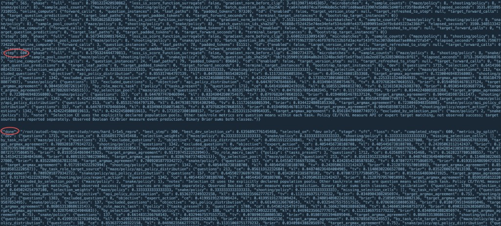

跑完了。`done` 出来，终端回到提示符。产物在 `$RUNS/hard_lr1e5_repro/`，完整终端日志在旁边的 `hard_lr1e5_repro.log`。

**总览**

| 项 | 数字 |
|---|---|
| `completed_steps` | 600 |
| `best_step` | **300**（按 dev selection_ce 最低选的） |
| `best_dev_selection_ce` | **0.636** |
| 训练墙钟 `training_seconds` | ≈ 3770 秒 ≈ **63 分钟**（和预估 1～1.5 小时对上） |
| 峰值显存 | ≈ 16.9G |
| 权重 sha256 | `f53eadbd34eb5a1040d9d579c64bebde45a7180fa3b012d187e64c118c09022f` |

**验证曲线**（每 100 步一次；越低越好）：

| step | selection_ce |
|---|---|
| 100 | 0.659 |
| 200 | 0.650 |
| **300** | **0.636** ← 选中 |
| 400 | 0.639 |
| 500 | 0.646 |
| 600 | 0.641 |

官方故事里常提大约第 400 步；我这次 **300 略好于 400**（0.636 vs 0.639），300 之后有轻微回升，所以没选最后一步——正常，脚本就是按 dev 最低留 checkpoint。

**跟 2 步试跑比（同一套 dev）：**

| | 试跑（step 2） | 正式（best=300） |
|---|---|---|
| selection_ce | 0.939 | **0.636** |
| 射击 argmax 对上 | ~27% | **~86%** |
| 蛇 argmax 对上 | ~90% | ~92% |
| 迷宫 argmax 对上 | ~71% | ~71% |

射击涨得最猛，迷宫几乎没动——迷宫本来就不差，这轮 CE 主要把射击从「瞎猜」拉上来了。

**各 split 的 selection_ce（用选中的第 300 步权重）：**

- dev 0.636 / calibration 0.645 / test 0.678 / ood 0.759  
- ood 高一截正常（分布更偏）。

阶段 6.2 通过：公开 hard CE SFT 配方在这台 A800 上复现出一条可核对的权重。

### 阶段 7 · 训完收口

训练主线（阶段 6）已经跑通。阶段 7 做四件事，按顺序：用自己的权重推理 → 和官方权重对同一条玩具请求 → 补上阶段 1 三句理解 → 写一段训完小结。  
这轮先不动：调 Jev、重录专家、四条臂对着打。548 局全评测留到下一档。

#### 7.1 用自己训出的权重起服务，打一条玩具请求

阶段 6 结束时，我手里多了一份自己训出来的 `best.safetensors`，还有一堆 `selection_ce`。那些数字只说明验证集上贴专家贴得怎样，**还没证明**这份权重能像阶段 4 的官方包一样：装进 `serve_decisions`，吃进状态，吐出 Choice / Boolean / Score 的概率。

所以这一步我把 `--checkpoint-dir` 换成 `$RUNS/hard_lr1e5_repro`，再用阶段 4.4 同一份玩具请求打一遍。玩具还是 `$NJ/research/toy_inference_example.json`（两段客服、六道题）。跟阶段 4 比，只换了权重：那边证官方包能跑，这边证我复现出来的也能跑。

先起服务（占 GPU，窗口别关）：

```bash
source /root/autodl-tmp/nanojev-study/.venv/bin/activate
export NJ=/root/autodl-tmp/NanoJev
export RUNS=/root/autodl-tmp/nanojev-study/runs
cd "$NJ"
CUDA_VISIBLE_DEVICES=0 python scripts/serve_decisions.py \
  --checkpoint-dir "$RUNS/hard_lr1e5_repro" \
  --web-root web --host 127.0.0.1 --port 8765 --disable-native-triton
```

服务端我看到的：

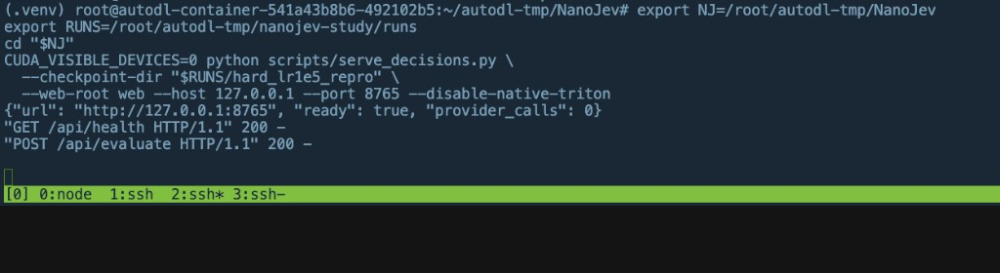

```
{"url": "http://127.0.0.1:8765", "ready": true, "provider_calls": 0}
"GET /api/health HTTP/1.1" 200 -
"POST /api/evaluate HTTP/1.1" 200 -
```

这几行的意思：`ready` 是权重装进内存了；`provider_calls: 0` 是没调外面的 API；后面两条 200 是另一终端的 health / evaluate 打进来成功了。答案不在这个窗口里打印。

另开终端打请求。evaluate 我加了 `-o`，把整份 JSON 落到文件里，所以这个终端屏幕上几乎只看得到 health 那一行：

```bash
export NJ=/root/autodl-tmp/NanoJev
mkdir -p /root/autodl-tmp/nanojev-study/notes/stage7
curl -s http://127.0.0.1:8765/api/health
curl -s http://127.0.0.1:8765/api/evaluate \
  -H 'Content-Type: application/json' \
  --data-binary @"$NJ/research/toy_inference_example.json" \
  -o /root/autodl-tmp/nanojev-study/notes/stage7/repro_evaluate.json
```

请求侧我看到的：

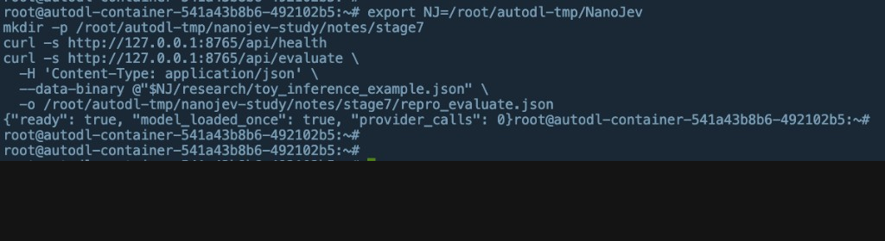

```
{"ready": true, "model_loaded_once": true, "provider_calls": 0}
```

`ready` / `model_loaded_once` 说明服务活着、模型在 GPU 里；`provider_calls: 0` 还是全本地。

真正的推理结果在 `notes/stage7/repro_evaluate.json`。我 `cat` 了一眼：

```bash
cat /root/autodl-tmp/nanojev-study/notes/stage7/repro_evaluate.json
```

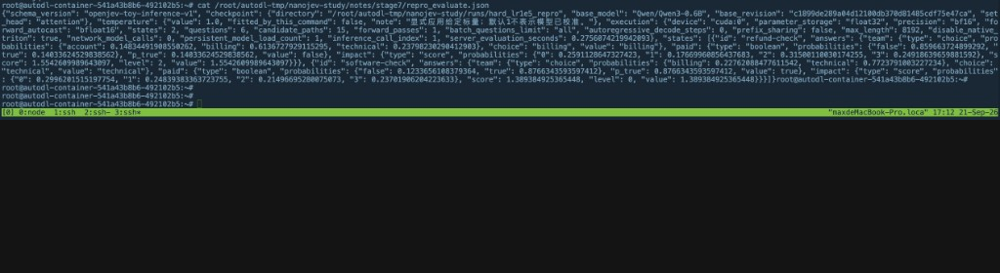

文件是一整行，我整理成下面这份（概率四舍五入到三位）。原始文件路径不变。

```json
{
  "schema_version": "openjev-toy-inference-v1",
  "checkpoint": {
    "directory": "/root/autodl-tmp/nanojev-study/runs/hard_lr1e5_repro",
    "base_model": "Qwen/Qwen3-0.6B",
    "base_revision": "c1899de289a04d12100db370d81485cdf75e47ca",
    "set_head": "attention"
  },
  "execution": {
    "device": "cuda:0",
    "precision": "bf16",
    "states": 2,
    "questions": 6,
    "candidate_paths": 15,
    "forward_passes": 1,
    "autoregressive_decode_steps": 0,
    "network_model_calls": 0,
    "server_evaluation_seconds": 0.276
  },
  "states": [
    {
      "id": "refund-check",
      "answers": {
        "team": {
          "type": "choice",
          "probabilities": {"account": 0.148, "billing": 0.614, "technical": 0.238},
          "choice": "billing"
        },
        "paid": {
          "type": "boolean",
          "probabilities": {"false": 0.860, "true": 0.140},
          "p_true": 0.140,
          "value": false
        },
        "impact": {
          "type": "score",
          "probabilities": {"0": 0.259, "1": 0.177, "2": 0.315, "3": 0.249},
          "score": 1.554,
          "level": 2
        }
      }
    },
    {
      "id": "software-check",
      "answers": {
        "team": {
          "type": "choice",
          "probabilities": {"billing": 0.228, "technical": 0.772},
          "choice": "technical"
        },
        "paid": {
          "type": "boolean",
          "probabilities": {"false": 0.123, "true": 0.877},
          "p_true": 0.877,
          "value": true
        },
        "impact": {
          "type": "score",
          "probabilities": {"0": 0.300, "1": 0.248, "2": 0.215, "3": 0.237},
          "score": 1.389,
          "level": 0
        }
      }
    }
  ]
}
```

我怎么读这份 JSON：

- `checkpoint.directory` 是 `.../hard_lr1e5_repro`——确实用的是我训的，不是官方 `NanoJev-unified`
- `autoregressive_decode_steps: 0`——一个字都没生成；2 份状态、6 道题、15 条路径，一次前向，大约 0.28 秒；`network_model_calls: 0`。这个字段数的是「这次推理有没有去呼叫网上的模型服务」（比如远端 API）。是 0 就表示题全在本机 GPU 上算完，没有把状态送到外网再等结果回来。
- `states[].answers` 才是六道题的答案：

| 状态 | 题 | 类型 | 结论 | 概率要点 |
|---|---|---|---|---|
| refund-check | team | Choice | **billing** | billing ≈ 0.61，account ≈ 0.15，technical ≈ 0.24 |
| refund-check | paid | Boolean | **false**（没到账） | `p_true` ≈ 0.14 |
| refund-check | impact | Score | **level 2** | 第 2 档最高（≈ 0.32） |
| software-check | team | Choice | **technical** | technical ≈ 0.77，billing ≈ 0.23 |
| software-check | paid | Boolean | **true**（到了） | `p_true` ≈ 0.88 |
| software-check | impact | Score | **level 0** | 第 0 档最高（≈ 0.30） |

对照 JSON 里一道题怎么找结论：比如 `team` 是选择题，看 `"choice": "billing"` 就是选中的项，旁边的 `probabilities` 是三个组各占多少；`paid` 是是非题，看 `"value": false` 和 `p_true`（「是」的把握有多大）；`impact` 是打分题，看 `"level": 2` 落在第几档，`probabilities` 里 `"0"`～`"3"` 是各档概率。字段百科和阶段 4 同一套 schema，见文末：[附录 A · 玩具推理 JSON 怎么读](#appendix-a)。这边和 4.4 的主要差别就是 `checkpoint.directory`。

7.1 我确认了：自训权重能起服务、能打玩具请求、`decode` 为 0、六道题都有概率输出。跟官方好不好比，放到 7.2。服务端 Ctrl+C 停掉，换官方权重。

#### 7.2 同一条请求，对比官方 `NanoJev-unified`

7.1 过了。我把服务停掉，改成加载官方发布的 `NanoJev-unified`，玩具请求一字不改，看六道题的最终选择（argmax）跟我训的那份是不是一样。概率数字不必一模一样——我选的是第 300 步，官方是另一条 run。

```bash
source /root/autodl-tmp/nanojev-study/.venv/bin/activate
export NJ=/root/autodl-tmp/NanoJev
export CKPT=/root/autodl-tmp/nanojev-study/ckpts
cd "$NJ"
CUDA_VISIBLE_DEVICES=0 python scripts/serve_decisions.py \
  --checkpoint-dir "$CKPT/NanoJev-unified" \
  --web-root web --host 127.0.0.1 --port 8765 --disable-native-triton
```

服务端我看到的：

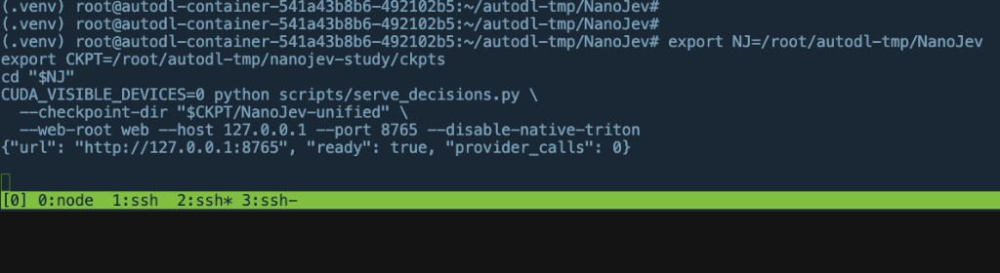

```
{"url": "http://127.0.0.1:8765", "ready": true, "provider_calls": 0}
```

另开终端，请求文件不变，结果写到 `official_evaluate.json`：

```bash
export NJ=/root/autodl-tmp/NanoJev
curl -s http://127.0.0.1:8765/api/evaluate \
  -H 'Content-Type: application/json' \
  --data-binary @"$NJ/research/toy_inference_example.json" \
  -o /root/autodl-tmp/nanojev-study/notes/stage7/official_evaluate.json
```

屏幕上几乎没字（答案进了文件）。我 `cat` 了一眼：

```bash
cat /root/autodl-tmp/nanojev-study/notes/stage7/official_evaluate.json
```

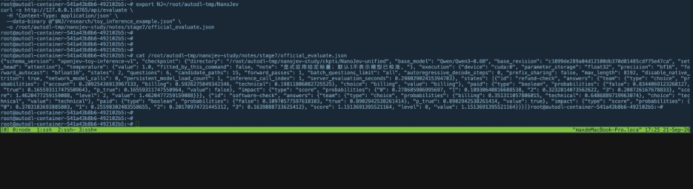

整理后的要点（概率三位）：`checkpoint.directory` 是 `.../ckpts/NanoJev-unified`；`decode` 仍是 0；大约 0.30 秒；`network_model_calls: 0`。六道题：

| 状态 | 题 | 官方结论 |
|---|---|---|
| refund-check | team | **billing**（≈ 0.59） |
| refund-check | paid | **false**，`p_true` ≈ 0.17 |
| refund-check | impact | **level 2** |
| software-check | team | **technical**（≈ 0.65） |
| software-check | paid | **true**，`p_true` ≈ 0.89 |
| software-check | impact | **level 0** |

跟 7.1 我训的那份对着看：

| 题 | 我的 repro | 官方 unified | 最终选择 |
|---|---|---|---|
| refund / team | billing 0.61 | billing 0.59 | 相同 |
| refund / paid | false 0.14 | false 0.17 | 相同 |
| refund / impact | level 2 | level 2 | 相同 |
| software / team | technical 0.77 | technical 0.65 | 相同 |
| software / paid | true 0.88 | true 0.89 | 相同 |
| software / impact | level 0 | level 0 | 相同 |

概率数字不完全一样（我选第 300 步，官方是另一条 run），但**六道题选的答案全一样**。两份 JSON 分别在 `notes/stage7/repro_evaluate.json` 和 `official_evaluate.json`。

7.2 我确认了：同一条玩具请求上，自训权重和官方发布包是同一档决策，不是比特级克隆。服务 Ctrl+C。

#### 7.3 补阶段 1 的三句理解

见上面 [阶段 1](#阶段-1--读代码看一道题是怎么变成概率的不用-gpu)「我的理解」——已按例题写完并勾上进度表。

#### 7.4 训完小结

四句收口：

1. **训了什么**：从官方 `training_initialization` 出发，hard 混合数据、CE SFT、600 步、`backbone 1e-5 / head 1e-4`、seed 17。  
2. **选了哪一步**：dev `selection_ce` 最低在 **第 300 步（0.636）**；400/600 略回升，没选最后一步。  
3. **比试跑好在哪**：试跑 selection_ce ≈ 0.94 → 正式 0.64；射击 argmax 约 27% → **86%**。  
4. **训完能干什么**：`$RUNS/hard_lr1e5_repro` 可当 `serve_decisions` 的 checkpoint；玩具请求上与官方 unified **argmax 全一致**。

阶段 7 通过。「搞懂 + 把公开 hard CE SFT 跑通」这条主线，今天可以收工了。

### 下一档 · 548 局大评测（明天）

玩具请求只证明接口通、跟官方选得一样。发布故事里那套更硬的尺子，是 **548 局** 对局评测：迷宫 / 蛇 / 射击（Basic + 打移动靶）按固定 case 集跑完整局，看成功率，不是看单题交叉熵。

结构稿已经另开一篇：[搞懂 NanoJev 的 548 局大评测](搞懂NanoJev的548局大评测.md)。明天从那篇的阶段 0 接着填。

---

## 进度


| 阶段     | 状态                               |
| ------ | -------------------------------- |
| 0 环境   | 通过：配方对齐，cuda True，A800，bf16 True |
| 1 读前向  | 通过：三句理解已补                        |
| 2 看录像  | 通过：Basic / 迷宫 / 蛇 / 打移动靶 四张回放    |
| 3 拆数据  | 通过：hard train 10898 行，四条样本已看     |
| 4 官方推理 | 通过：8765 服务 + 玩具请求，decode 0 |
| 5 空跑 | 通过：train 能训 10893，隔离 11 |
| 6 训练 | 通过：smoke 2 步 + 正式 600 步；best_step=300，dev CE≈0.636 |
| 7 收口 | 通过：自训推理 + 官方对比 + 三句理解 + 小结 |
| 8 · 548 局 | **明天**：大评测（悬念口子） |


版本对不上、踩的坑，也记在对应步骤的「我看到的」里。

---

## 我主要看过的材料

- NanoJev 的 README，以及 `docs/` 里发布、训练、接口那几篇
- 仓库 `research/` 里对 Jev 公开材料的核验
- TypeSafe 发布文、System One、三种问题、RLCD 那篇 primer
- 代码：`train_toy_decisions.py`、`predict_toy_decisions.py`、`train_unified_games.py`、`serve_decisions.py`、`configs/sonic_unified_sft_v1.json`

---

## 附录

| 编号 | 内容 | 对应阶段 |
|---|---|---|
| [A](#appendix-a) | 玩具推理 JSON 怎么读 | 4.4 / 7.1 |
| [B](#appendix-b) | 训练空跑 JSON 怎么读 | 5 |
| [C](#appendix-c) | 试跑训练日志怎么读 | 6.1 |

### 附录 A · 玩具推理 JSON 怎么读

<a id="appendix-a"></a>

对应阶段 [4.4](#44-打一条玩具请求再开一个终端)。那次 `POST /api/evaluate` 返回的是一整段 JSON。下面是格式化后的版本（概率四舍五入到三位），再按块讲。

```json
{
  "schema_version": "openjev-toy-inference-v1",
  "checkpoint": {
    "directory": "/root/autodl-tmp/nanojev-study/ckpts/NanoJev-unified",
    "base_model": "Qwen/Qwen3-0.6B",
    "base_revision": "c1899de289a04d12100db370d81485cdf75e47ca",
    "set_head": "attention"
  },
  "temperature": {
    "value": 1.0,
    "fitted_by_this_command": false,
    "note": "显式应用给定标量；默认1不表示模型已校准。"
  },
  "execution": {
    "device": "cuda:0",
    "parameter_storage": "float32",
    "precision": "bf16",
    "forward_autocast": "bfloat16",
    "states": 2,
    "questions": 6,
    "candidate_paths": 15,
    "forward_passes": 1,
    "batch_questions_limit": "all",
    "autoregressive_decode_steps": 0,
    "prefix_sharing": false,
    "max_length": 8192,
    "disable_native_triton": true,
    "network_model_calls": 0,
    "persistent_model_load_count": 1,
    "inference_call_index": 1,
    "server_evaluation_seconds": 0.2667650170624256
  },
  "states": [
    {
      "id": "refund-check",
      "answers": {
        "team": {
          "type": "choice",
          "probabilities": {
            "account": 0.209,
            "billing": 0.593,
            "technical": 0.198
          },
          "choice": "billing",
          "value": "billing"
        },
        "paid": {
          "type": "boolean",
          "probabilities": { "false": 0.834, "true": 0.166 },
          "p_true": 0.166,
          "value": false
        },
        "impact": {
          "type": "score",
          "probabilities": {
            "0": 0.279, "1": 0.189, "2": 0.323, "3": 0.209
          },
          "score": 1.462,
          "level": 2,
          "value": 1.462
        }
      }
    },
    {
      "id": "software-check",
      "answers": {
        "team": {
          "type": "choice",
          "probabilities": {
            "billing": 0.351,
            "technical": 0.649
          },
          "choice": "technical",
          "value": "technical"
        },
        "paid": {
          "type": "boolean",
          "probabilities": { "false": 0.110, "true": 0.890 },
          "p_true": 0.890,
          "value": true
        },
        "impact": {
          "type": "score",
          "probabilities": {
            "0": 0.378, "1": 0.256, "2": 0.202, "3": 0.164
          },
          "score": 1.151,
          "level": 0,
          "value": 1.151
        }
      }
    }
  ]
}
```

### 顶部：用的是谁

- **checkpoint**：本地那份 `NanoJev-unified`，骨干是 **Qwen3-0.6B**，决策头是 **attention**。
- **temperature 1.0**：分数直接进 softmax，没再额外拧尖或拧平；注释说「默认 1 ≠ 已经校准好」。

### execution：这次怎么算的（最值得盯）

| 字段 | 我这次的值 | 人话 |
|---|---|---|
| `states` | 2 | 两份状态：退款客服、软件故障 |
| `questions` | 6 | 每份 3 题，共 6 题 |
| `candidate_paths` | 15 | 所有选项拼出来的路径条数 |
| `forward_passes` | 1 | **一次**前向就算完 |
| `autoregressive_decode_steps` | **0** | **一个字都没生成** |
| `network_model_calls` | 0 | 没去调 Hugging Face / Jev 云端 |
| `persistent_model_load_count` | 1 | 权重只在起服务时装过一次 |
| `server_evaluation_seconds` | ~0.27 | 大约四分之一秒 |

路径怎么凑出 15：退款 Choice 3 + Boolean 1 + Score 4，软件 Choice 2 + Boolean 1 + Score 4 → 3+1+4+2+1+4=15。

### states：模型判了什么

**refund-check（被扣两次款）**

- **team**：billing 约 59% → 账单组（扣款/退款语境合理）
- **paid**：true 只有约 17% → 判「还没到账」
- **impact**：四档里 level 2 最高，期望分约 1.46 → 偏「核心受阻但有替代」那一档附近

**software-check（按钮坏了、退款已付完）**

- **team**：technical 约 65% → 技术组
- **paid**：true 约 89% → 判「退款已付完」
- **impact**：level 0 最高，期望分约 1.15 → 更偏「功能正常/影响不大」一侧（这题状态写了有 workaround，和退款那题不完全一样）

一句话：这不是聊天回复，是程序可读的**概率决策**。阶段 1 讲的 Choice / Boolean / Score，在这份 JSON 的 `answers` 里各出现了一次。

---

### 附录 B · 训练空跑 JSON 怎么读

<a id="appendix-b"></a>

对应阶段 [5](#阶段-5--训练空跑先不更新权重)。`--validate-only` 打印的是一整段审计 JSON：数据读进来了多少题、哪些能训、哪些被隔离。下面是格式化后的版本，再按块讲。

```json
{
  "records": 18760,
  "outcome_questions": 0,
  "continuation_policy_id": null,
  "questions_by_split_task_role": {
    "calibration/maze/policy": 188,
    "calibration/shooting/policy": 1383,
    "calibration/snake/policy": 138,
    "dev/maze/policy": 215,
    "dev/shooting/policy": 1342,
    "dev/snake/policy": 158,
    "ood/maze/policy": 202,
    "ood/shooting/policy": 1597,
    "ood/snake/policy": 143,
    "test/maze/policy": 211,
    "test/shooting/policy": 2169,
    "test/snake/policy": 116,
    "train/maze/policy": 653,
    "train/shooting/policy": 9842,
    "train/snake/policy": 403
  },
  "eligible_by_split_task_role": {
    "calibration/maze/policy": 188,
    "calibration/shooting/policy": 1383,
    "calibration/snake/policy": 137,
    "dev/maze/policy": 213,
    "dev/shooting/policy": 1342,
    "dev/snake/policy": 157,
    "ood/maze/policy": 202,
    "ood/shooting/policy": 1597,
    "ood/snake/policy": 141,
    "test/maze/policy": 211,
    "test/shooting/policy": 2169,
    "test/snake/policy": 116,
    "train/maze/policy": 651,
    "train/shooting/policy": 9842,
    "train/snake/policy": 400
  },
  "quarantined_policy_questions": 11,
  "policy_questions_by_split_task_target_kind": {
    "calibration/maze/api_policy_distribution": 188,
    "calibration/shooting/expert_action": 1383,
    "calibration/snake/api_policy_distribution": 138,
    "dev/maze/api_policy_distribution": 215,
    "dev/shooting/expert_action": 1342,
    "dev/snake/api_policy_distribution": 158,
    "ood/maze/api_policy_distribution": 202,
    "ood/shooting/expert_action": 1597,
    "ood/snake/api_policy_distribution": 143,
    "test/maze/api_policy_distribution": 211,
    "test/shooting/expert_action": 2169,
    "test/snake/api_policy_distribution": 116,
    "train/maze/api_policy_distribution": 653,
    "train/shooting/expert_action": 9842,
    "train/snake/api_policy_distribution": 403
  },
  "unique_episodes_by_split_task_role": {
    "calibration/maze/policy": 10,
    "calibration/shooting/policy": 128,
    "calibration/snake/policy": 8,
    "dev/maze/policy": 10,
    "dev/shooting/policy": 128,
    "dev/snake/policy": 8,
    "ood/maze/policy": 10,
    "ood/shooting/policy": 256,
    "ood/snake/policy": 8,
    "test/maze/policy": 10,
    "test/shooting/policy": 256,
    "test/snake/policy": 8,
    "train/maze/policy": 32,
    "train/shooting/policy": 1024,
    "train/snake/policy": 28
  },
  "rows_missing_episode_id_by_split_task_role": {},
  "outcome_episode_counts_by_split_task": {},
  "outcome_state_label_counts_by_split_task": {},
  "outcome_question_label_counts_by_split_task": {},
  "episode_audit_note": "Repeated states/questions are not independent episodes. Single-outcome cells are retained without forced balancing. Missing episode IDs are counted explicitly and excluded from episode totals.",
  "stage": "sft",
  "loss": "ce",
  "population_weights": {
    "maze/policy": 0.3333333333333333,
    "snake/policy": 0.3333333333333333,
    "shooting/policy": 0.3333333333333333
  },
  "eligible_by_split_sampling_pool": {
    "calibration/maze/policy": 188,
    "calibration/shooting/policy": 1383,
    "calibration/snake/policy": 137,
    "dev/maze/policy": 213,
    "dev/shooting/policy": 1342,
    "dev/snake/policy": 157,
    "ood/maze/policy": 202,
    "ood/shooting/policy": 1597,
    "ood/snake/policy": 141,
    "test/maze/policy": 211,
    "test/shooting/policy": 2169,
    "test/snake/policy": 116,
    "train/maze/policy": 651,
    "train/shooting/policy": 9842,
    "train/snake/policy": 400
  },
  "td_enabled": false,
  "td_audit": null
}
```

### 这几项我怎么读

| 字段 | 人话 |
|---|---|
| `records` | hard 包里一共拆出 **18760** 道题（五个 split × 三个游戏） |
| `questions_by_split_task_role` | 原始题数；train 迷宫 653 + 射击 9842 + 蛇 403 = **10898** |
| `eligible_by_split_task_role` | 真正能进损失的题；train = 651+9842+400 = **10893** |
| `quarantined_policy_questions` | 标签不合格被隔离的题，一共 **11**；train 里丢掉 5 条 |
| `policy_questions_by_split_task_target_kind` | 标签从哪来：迷宫/蛇是 `api_policy_distribution`（teacher 分布），射击是 `expert_action`（专家动作） |
| `unique_episodes_by_split_task_role` | 独立对局大约多少局；一条题 ≠ 一局，一局里会有很多决策步 |
| `population_weights` | 训练时三个任务各抽约 **1/3**，免得射击题太多把另外两个盖住 |
| `stage` / `loss` | 这轮是 SFT + 交叉熵（`ce`） |
| `td_enabled` | `false`：不是时序差分那套，纯监督 |

一句话：空跑等于「开训前对账」。数字对上文档的约 10893，我就可以放心进阶段 6。

---

### 附录 C · 试跑训练日志怎么读

<a id="appendix-c"></a>

对应阶段 [6.1](#61-先试跑-2-步)。`--steps 2 --eval-every 2` 跑完，终端上主要是：**两条 `step` JSON + 一条 `done` JSON**。下面按行讲；数字是我这次 smoke 实际打出来的。

### 两条 `step` —— 训练在干活

每训完一步（更新一次参数）打一行。step 1 精简版：

```json
{
  "step": 1,
  "phase": "full",
  "loss": 0.7437,
  "loss_is_score_function_surrogate": false,
  "gradient_norm_before_clip": 5.24,
  "microbatches": 4,
  "sample_counts": {"maze/policy": 8, "shooting/policy": 8, "snake/policy": 8},
  "batch_question_ids_sha256": "bc926b53…",
  "elapsed_seconds": 5.36,
  "online_compute": {
    "forward_calls": 4,
    "question_instances": 24,
    "leaf_paths": 76,
    "padded_tokens": 65940
  },
  "td": {"enabled": false}
}
```

step 2 在同样结构上多了一块 `dev`（因为 `--eval-every 2`，第 2 步顺带验证）：

```json
{
  "step": 2,
  "loss": 1.1007,
  "elapsed_seconds": 13.27,
  "dev": {
    "questions": 1715,
    "selection_ce": 0.9387,
    "by_task_role": {
      "maze/policy": {"ce": 0.86, "target_argmax_agreement": 0.71},
      "shooting/policy": {"ce": 1.30, "target_argmax_agreement": 0.27},
      "snake/policy": {"ce": 0.66, "target_argmax_agreement": 0.90}
    }
  }
}
```

| 字段 | 人话 |
|---|---|
| `step` | 第几步。试跑是 1、2；正式训会到 600。 |
| `phase: "full"` | 这一步是完整训练步，不是只评测。 |
| `loss` | 这一步 batch 上的交叉熵。两步抽的题不同，数字跳一跳正常；**2 步看不出有没有学好**。 |
| `loss_is_score_function_surrogate` | `false`：这是真 CE，不是某种代理损失。 |
| `gradient_norm_before_clip` | 裁剪前的梯度范数。有数、不是 nan，说明反向传播正常。 |
| `microbatches` | 24 题一次吃不下时，拆成几段小 batch 累加梯度。 |
| `sample_counts` | 这一步实际抽到：迷宫 / 射击 / 蛇各 8 题。 |
| `batch_question_ids_sha256` | 「抽了哪几题」的指纹；步与步不同 = 换 batch 了。 |
| `elapsed_seconds` | 这一步墙钟时间（不含开头加载模型）。 |
| `online_compute` | 这一步算了多少：几次 forward、多少题、多少 leaf path、pad 后多少 token。 |
| `td.enabled` | `false`：时序差分没开；现在是纯 CE SFT。 |
| `dev.selection_ce` | 用来**选最好 checkpoint** 的验证交叉熵（三个任务池各约 1/3 再平均）。 |
| `dev.by_task_role` | 各游戏自己的 CE，以及 `target_argmax_agreement`（预测 argmax 跟目标对上的比例）。试跑时蛇最好、射击最差，才 2 步很正常。 |

### 那条 `done` —— 整次跑完的总结

脚本结束时打一行（并写成 `summary.json`）。精简版：

```json
{
  "done": "/root/autodl-tmp/nanojev-study/runs/hard_lr1e5_smoke",
  "best_step": 2,
  "best_dev_selection_ce": 0.9387,
  "completed_steps": 2,
  "metrics_by_split": {
    "dev": {"selection_ce": 0.9387},
    "calibration": {"selection_ce": 0.9506},
    "test": {"selection_ce": 0.9393},
    "ood": {"selection_ce": 0.9475}
  },
  "training_seconds": 71.8,
  "max_gpu_allocated_gb": 16.4,
  "weights_sha256": "33a67f93…1ce9"
}
```

| 字段 | 人话 |
|---|---|
| `done` | 输出目录路径。 |
| `best_step` / `best_dev_selection_ce` | 按 **dev 的 selection_ce** 选中的步；试跑只有 step 2 评过，所以是 2。 |
| `completed_steps` | 一共训了几步。 |
| `metrics_by_split` | 用最终选中的权重，在 dev / calibration / test / ood 上各评一遍（所以 `done` 前会多花一会儿写 `predictions_*.jsonl`）。 |
| `training_seconds` | 训练段总耗时（含中间验证等）。我这次约 72 秒。 |
| `max_gpu_allocated_gb` | 峰值显存；我这次约 16.4G。 |
| `weights_sha256` | 写出的 `best.safetensors` 校验和。 |

一句话：**`step` = 这一步训得怎样；`done` = 这次选了哪一步、各划分分数、花了多久、权重指纹。** 正式 600 步时，会看到 step 1…600，每隔 100 步带一次 `dev`，最后再来一条 `done`。

